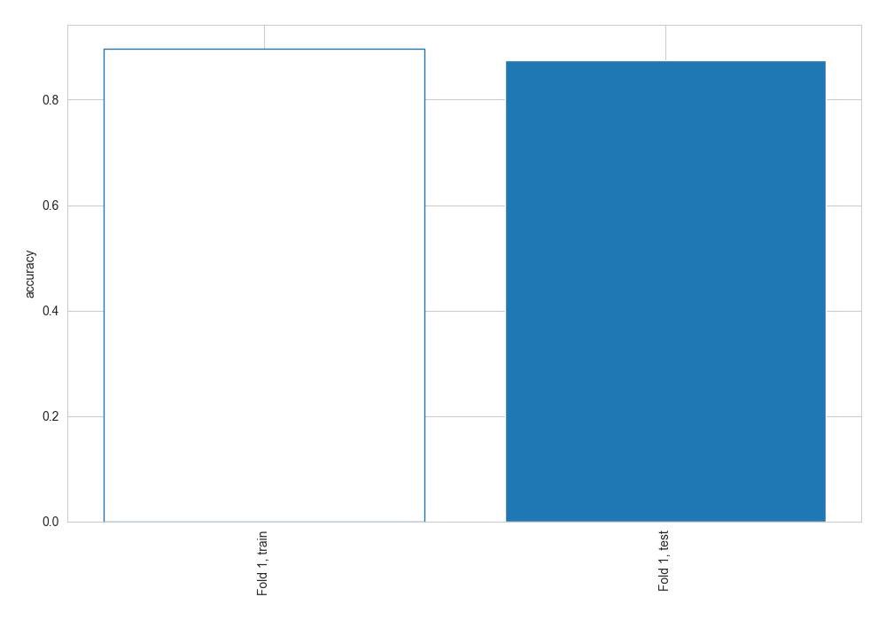
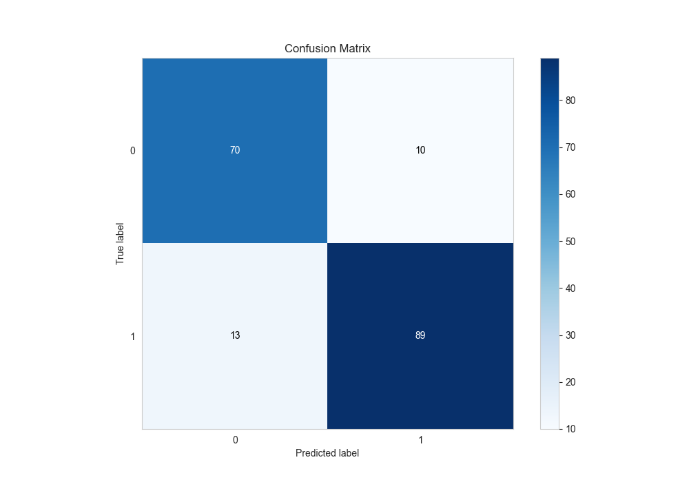
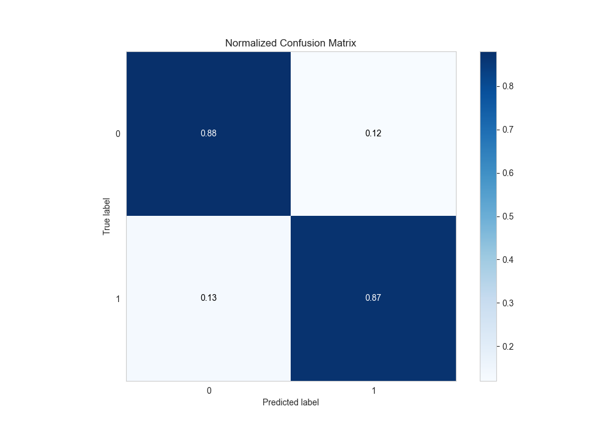
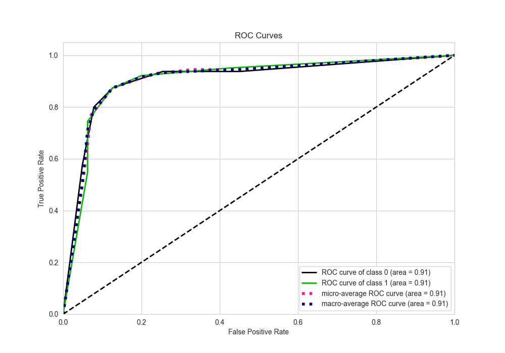
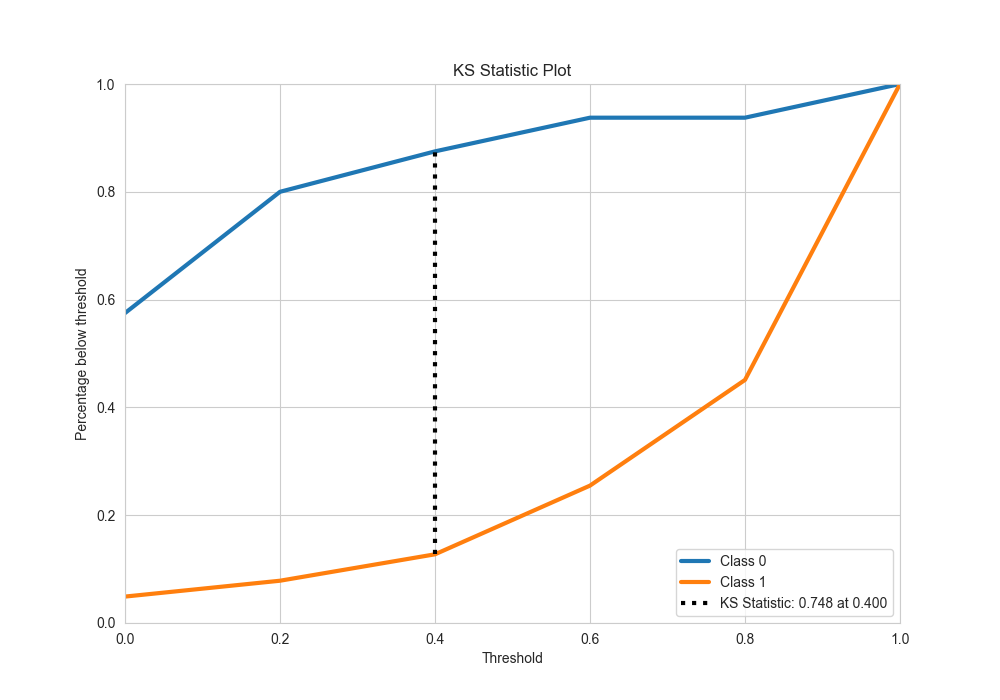
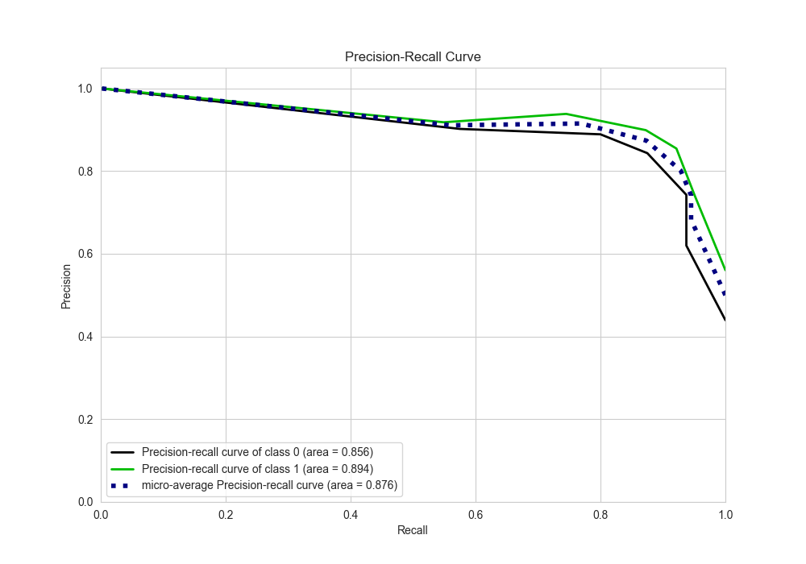
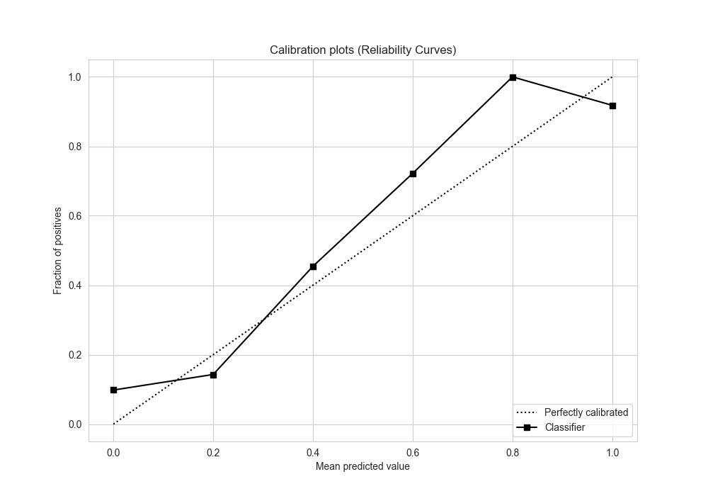
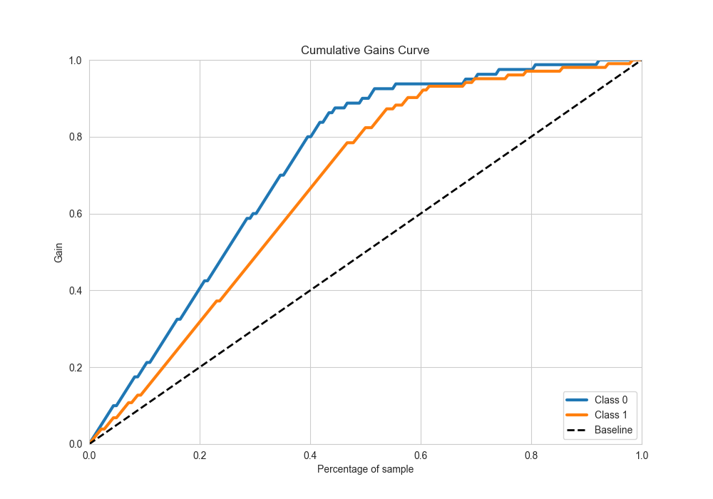
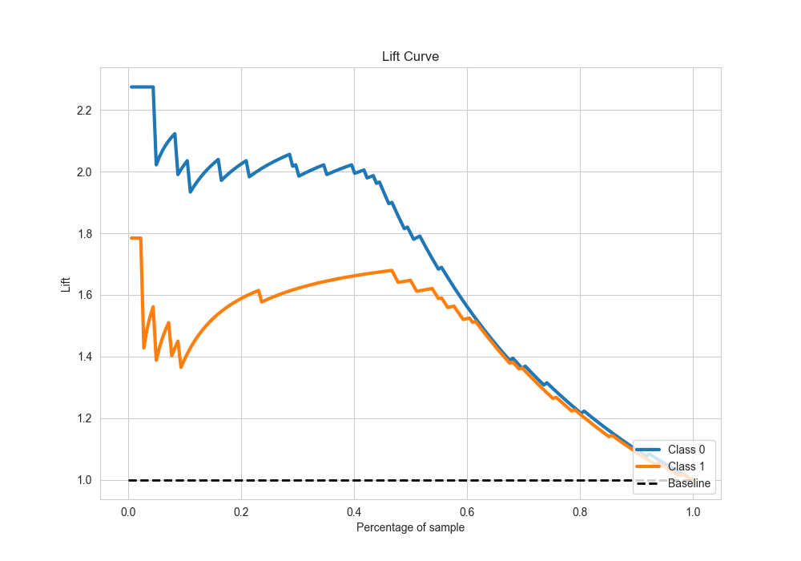

# Summary of 10_Default_NearestNeighbors

[<< Go back](../README.md)

## k-Nearest Neighbors (Nearest Neighbors)
- **n_jobs**: -1
- **n_neighbors**: 5
- **weights**: uniform
- **explain_level**: 2

## Validation
 - **validation_type**: split
 - **train_ratio**: 0.75
 - **shuffle**: True
 - **stratify**: True

## Optimized metric
accuracy

## Training time

1.7 seconds

## Metric details
|           |    score |   threshold |
|:----------|---------:|------------:|
| logloss   | 1.05275  |       nan   |
| auc       | 0.906556 |       nan   |
| f1        | 0.886792 |         0.2 |
| accuracy  | 0.873626 |         0.4 |
| precision | 0.938272 |         0.6 |
| recall    | 0.95098  |         0   |
| mcc       | 0.744952 |         0.4 |

## Metric details with threshold from accuracy metric
|           |    score |   threshold |
|:----------|---------:|------------:|
| logloss   | 1.05275  |       nan   |
| auc       | 0.906556 |       nan   |
| f1        | 0.885572 |         0.4 |
| accuracy  | 0.873626 |         0.4 |
| precision | 0.89899  |         0.4 |
| recall    | 0.872549 |         0.4 |
| mcc       | 0.744952 |         0.4 |

## Confusion matrix (at threshold=0.4)
|              |   Predicted as 0 |   Predicted as 1 |
|:-------------|-----------------:|-----------------:|
| Labeled as 0 |               70 |               10 |
| Labeled as 1 |               13 |               89 |

## Learning curves

## Confusion Matrix

## Normalized Confusion Matrix

## ROC Curve

## Kolmogorov-Smirnov Statistic

## Precision-Recall Curve

## Calibration Curve

## Cumulative Gains Curve

## Lift Curve

[<< Go back](../README.md)
