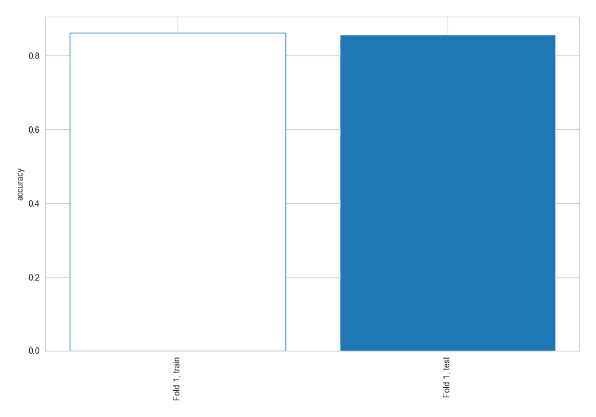
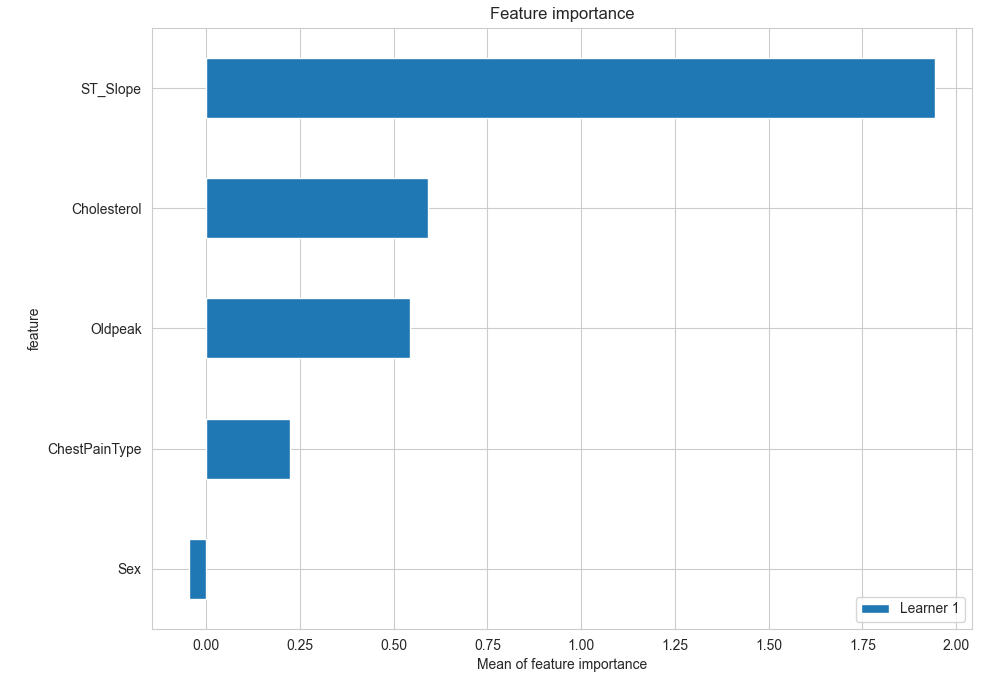
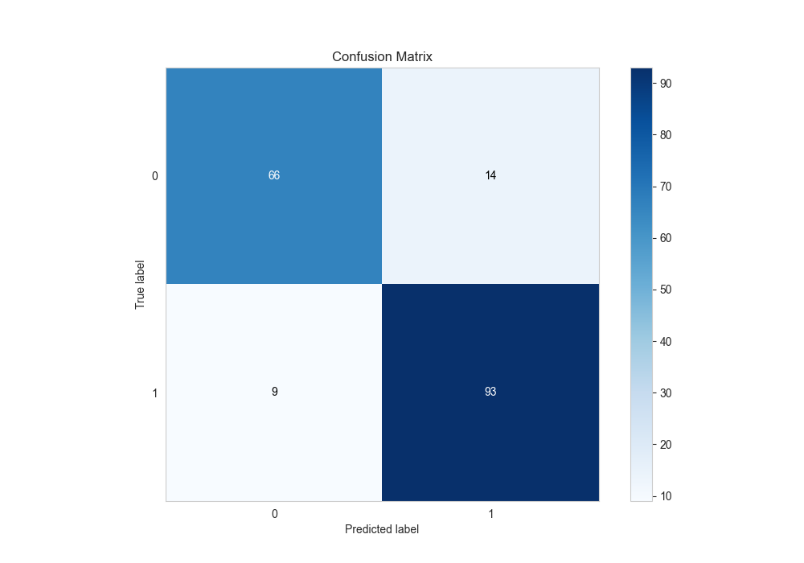
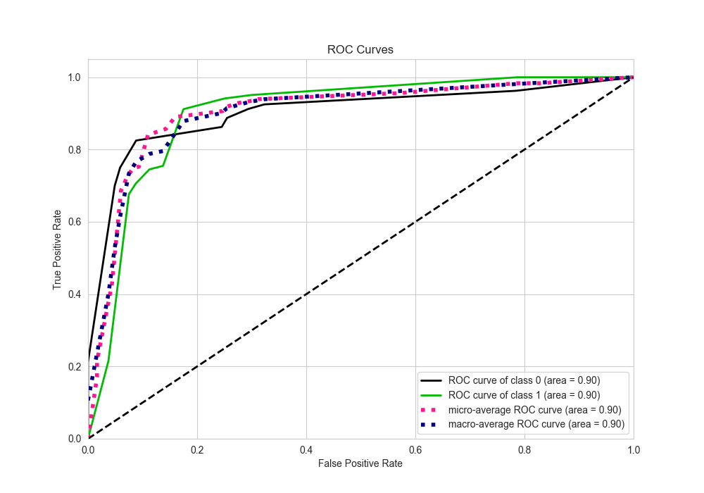
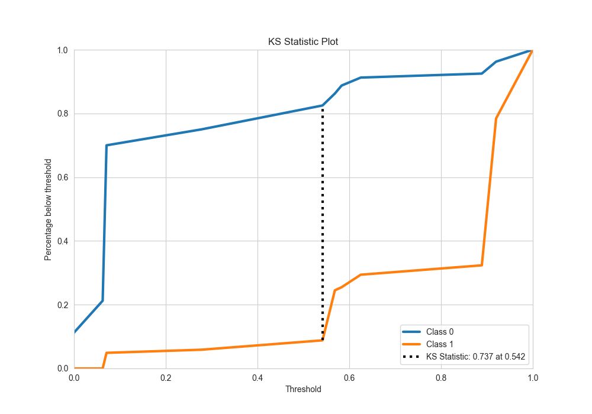
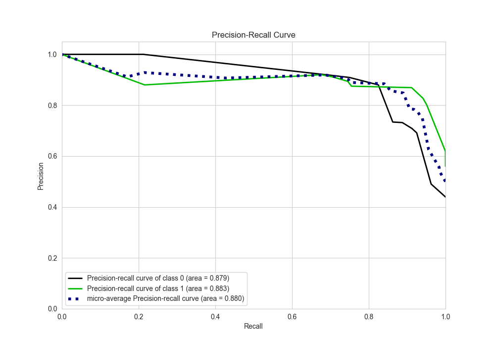
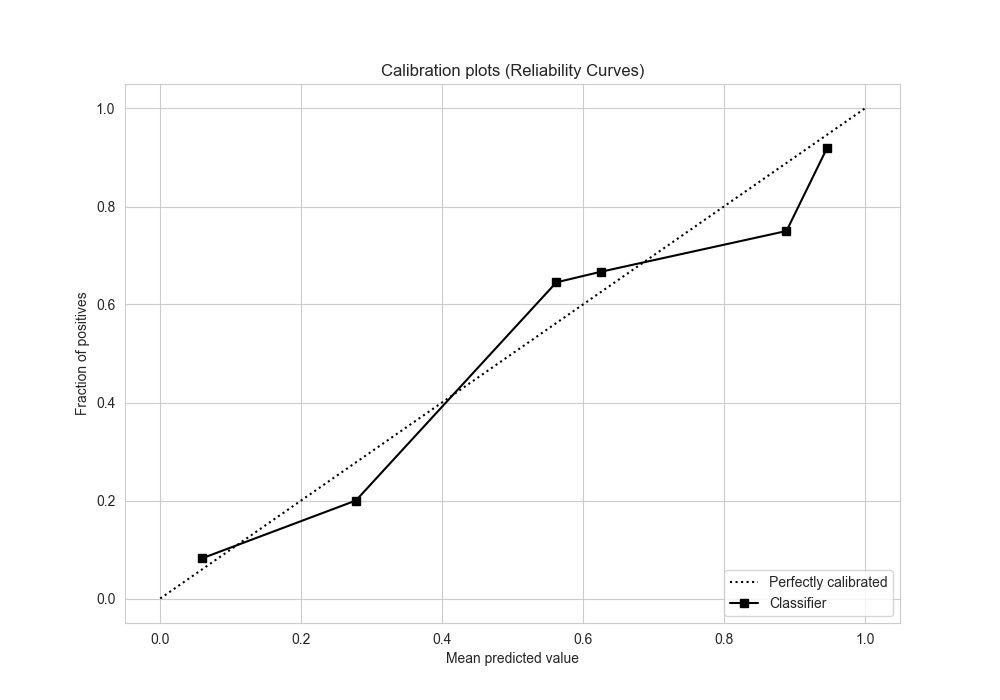
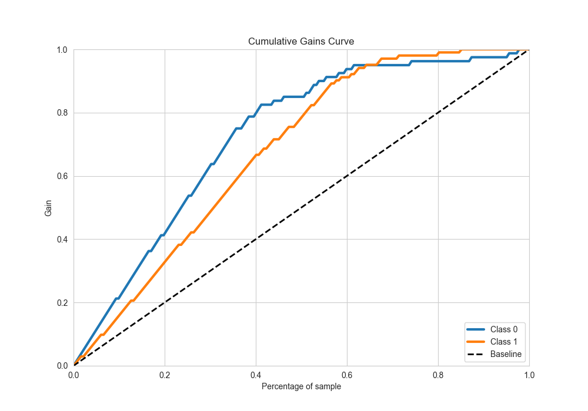
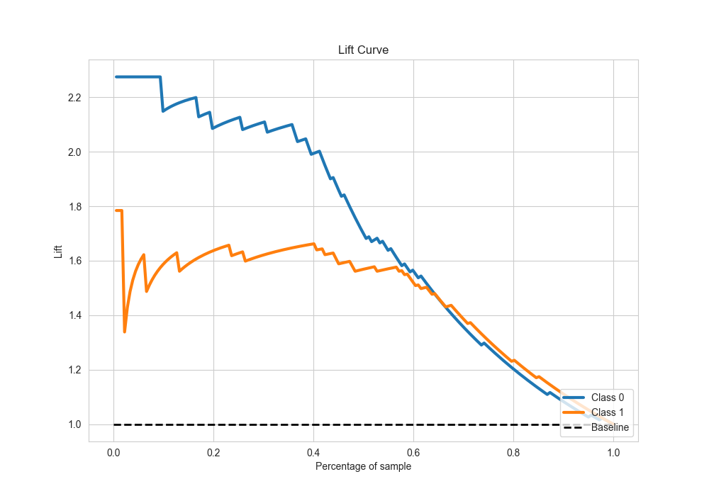

# Summary of 2_DecisionTree

[<< Go back](../README.md)

## Decision Tree
- **n_jobs**: -1
- **criterion**: entropy
- **max_depth**: 4
- **explain_level**: 2

## Validation
 - **validation_type**: split
 - **train_ratio**: 0.75
 - **shuffle**: True
 - **stratify**: True

## Optimized metric
accuracy

## Training time

7.6 seconds

## Metric details
|           |    score |   threshold |
|:----------|---------:|------------:|
| logloss   | 0.578466 |  nan        |
| auc       | 0.90239  |  nan        |
| f1        | 0.889952 |    0.541667 |
| accuracy  | 0.873626 |    0.541667 |
| precision | 0.911392 |    0.625    |
| recall    | 1        |    0        |
| mcc       | 0.742936 |    0.541667 |

## Metric details with threshold from accuracy metric
|           |    score |   threshold |
|:----------|---------:|------------:|
| logloss   | 0.578466 |  nan        |
| auc       | 0.90239  |  nan        |
| f1        | 0.889952 |    0.541667 |
| accuracy  | 0.873626 |    0.541667 |
| precision | 0.869159 |    0.541667 |
| recall    | 0.911765 |    0.541667 |
| mcc       | 0.742936 |    0.541667 |

## Confusion matrix (at threshold=0.541667)
|              |   Predicted as 0 |   Predicted as 1 |
|:-------------|-----------------:|-----------------:|
| Labeled as 0 |               66 |               14 |
| Labeled as 1 |                9 |               93 |

## Learning curves

## Permutation-based Importance

## Confusion Matrix

## Normalized Confusion Matrix

## ROC Curve

## Kolmogorov-Smirnov Statistic

## Precision-Recall Curve

## Calibration Curve

## Cumulative Gains Curve

## Lift Curve

[<< Go back](../README.md)
