# Summary of 3_Linear

[<< Go back](../README.md)

## Logistic Regression (Linear)
- **n_jobs**: -1
- **explain_level**: 2

## Validation
 - **validation_type**: split
 - **train_ratio**: 0.75
 - **shuffle**: True
 - **stratify**: True

## Optimized metric
accuracy

## Training time

7.9 seconds

## Metric details
|           |    score |   threshold |
|:----------|---------:|------------:|
| logloss   | 0.370831 | nan         |
| auc       | 0.921507 | nan         |
| f1        | 0.885845 |   0.317286  |
| accuracy  | 0.862637 |   0.317286  |
| precision | 0.902439 |   0.658034  |
| recall    | 1        |   0.0109465 |
| mcc       | 0.726108 |   0.317286  |

## Metric details with threshold from accuracy metric
|           |    score |   threshold |
|:----------|---------:|------------:|
| logloss   | 0.370831 |  nan        |
| auc       | 0.921507 |  nan        |
| f1        | 0.885845 |    0.317286 |
| accuracy  | 0.862637 |    0.317286 |
| precision | 0.82906  |    0.317286 |
| recall    | 0.95098  |    0.317286 |
| mcc       | 0.726108 |    0.317286 |

## Confusion matrix (at threshold=0.317286)
|              |   Predicted as 0 |   Predicted as 1 |
|:-------------|-----------------:|-----------------:|
| Labeled as 0 |               60 |               20 |
| Labeled as 1 |                5 |               97 |

## Learning curves
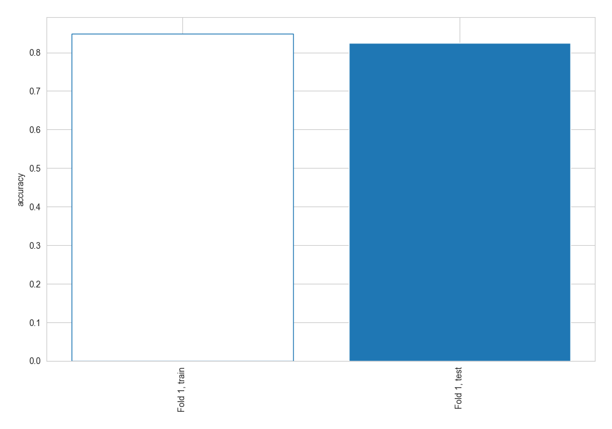

## Coefficients
| feature       |   Learner_1 |
|:--------------|------------:|
| Oldpeak       |    0.764077 |
| Sex           |    0.599351 |
| intercept     |    0.431821 |
| Cholesterol   |   -0.294242 |
| ChestPainType |   -0.751457 |
| ST_Slope      |   -1.14856  |

## Permutation-based Importance
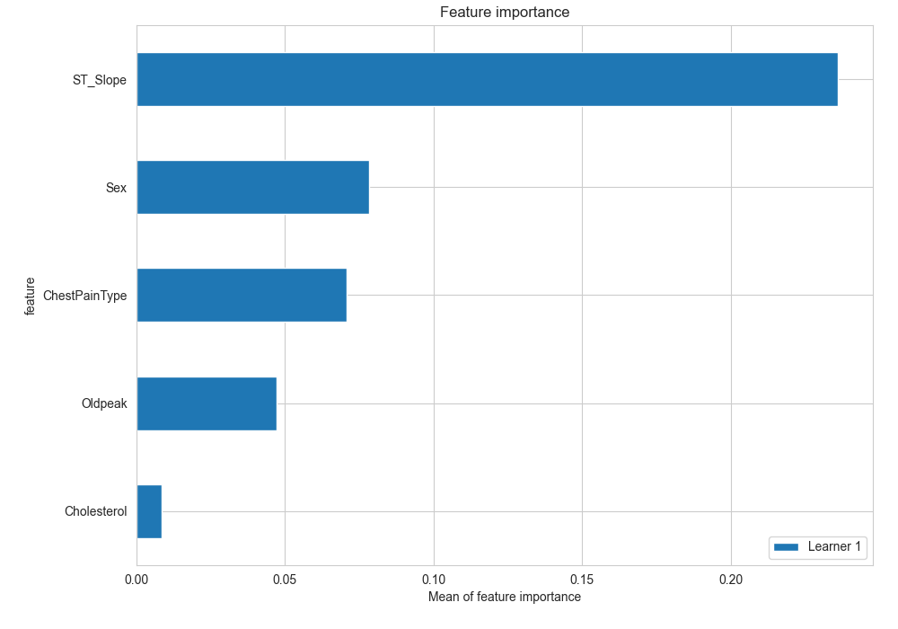
## Confusion Matrix

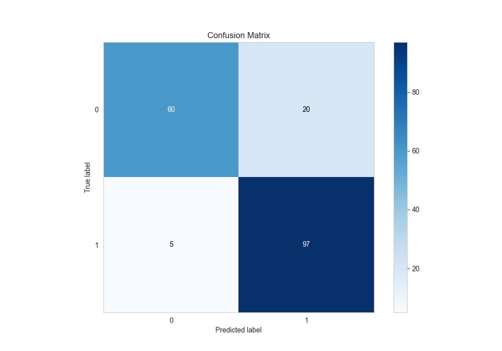

## Normalized Confusion Matrix

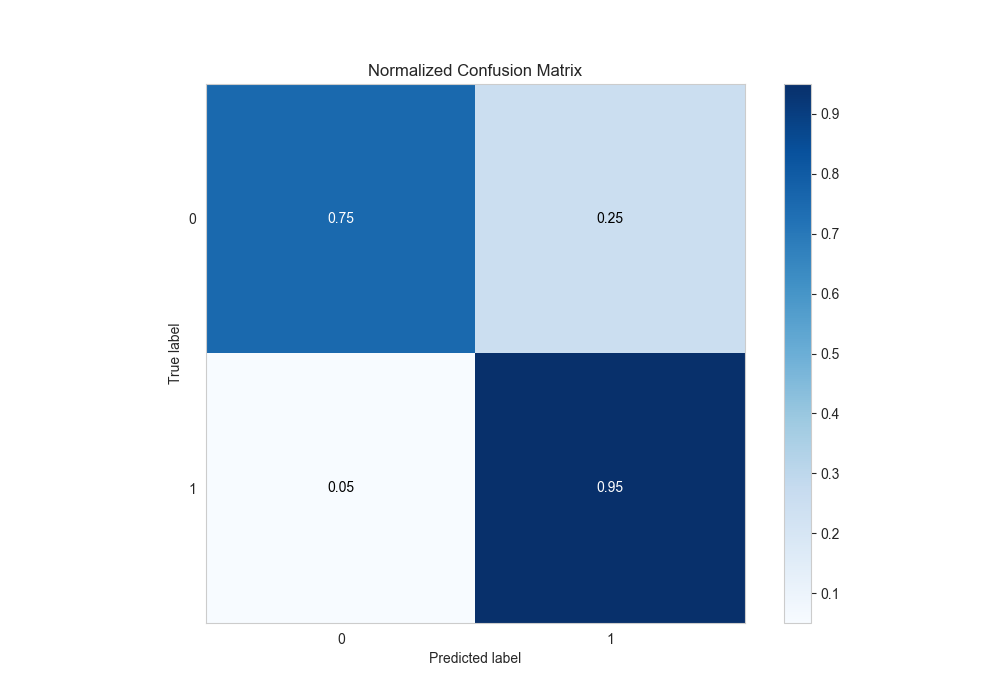

## ROC Curve

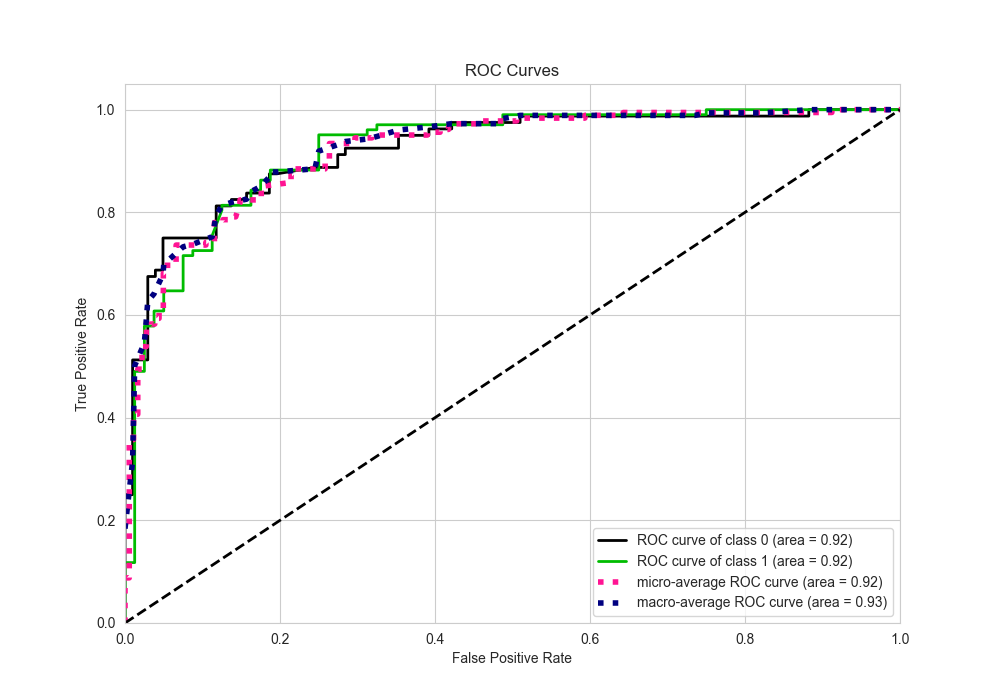

## Kolmogorov-Smirnov Statistic

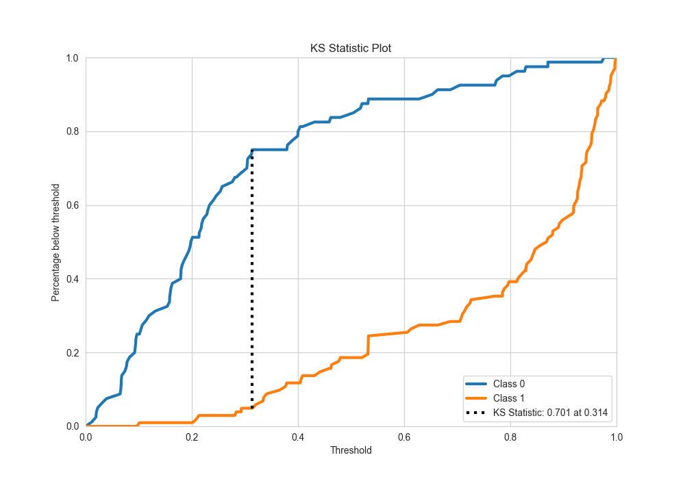

## Precision-Recall Curve

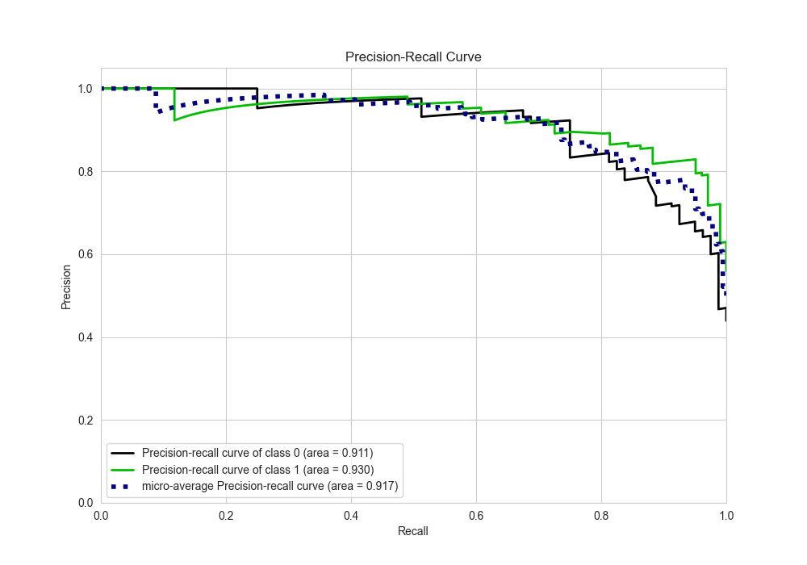

## Calibration Curve

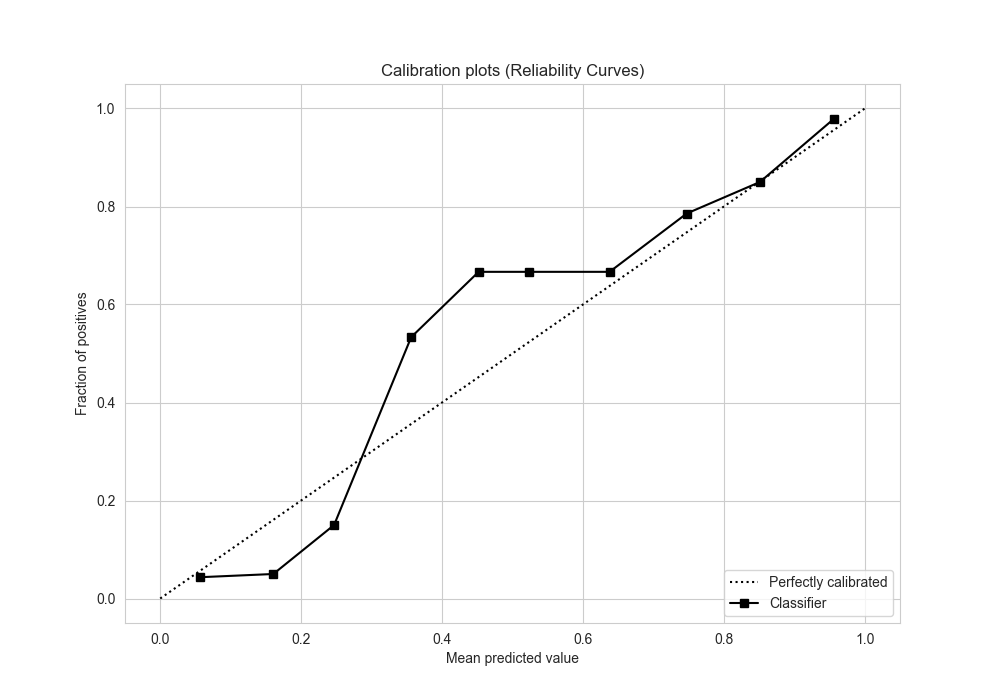

## Cumulative Gains Curve

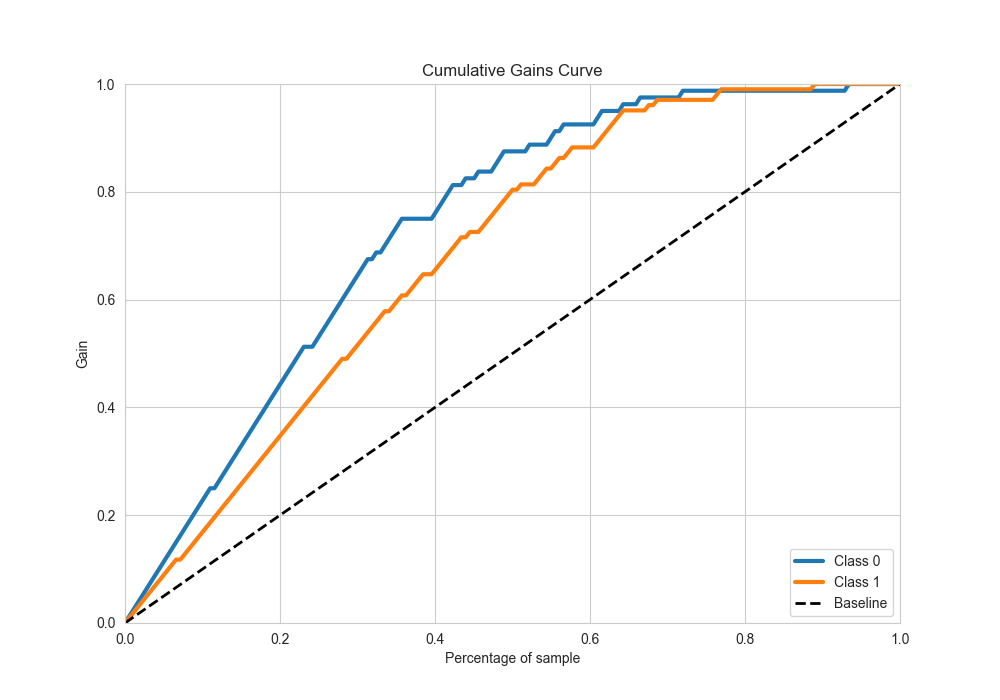

## Lift Curve

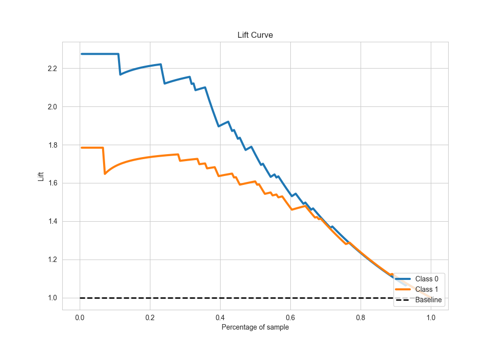

## SHAP Importance
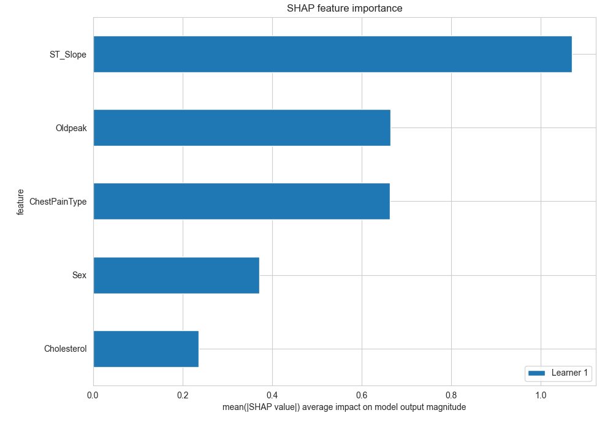

## SHAP Dependence plots

### Dependence (Fold 1)
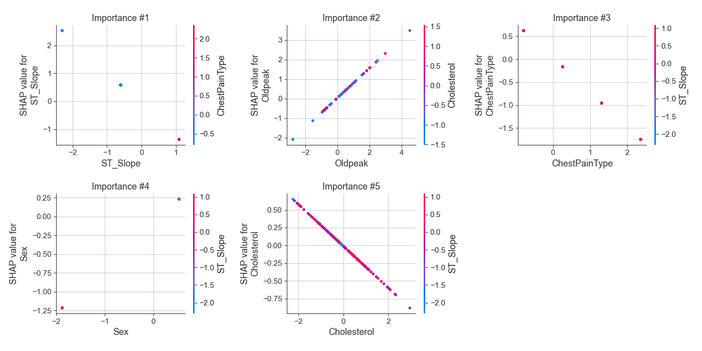

## SHAP Decision plots

### Top-10 Worst decisions for class 0 (Fold 1)
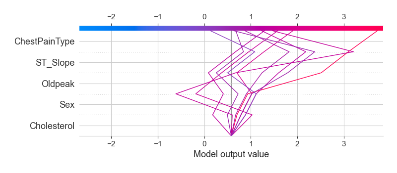
### Top-10 Best decisions for class 0 (Fold 1)
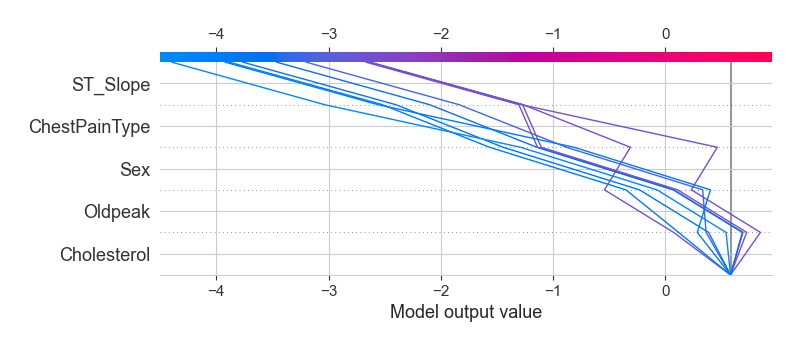
### Top-10 Worst decisions for class 1 (Fold 1)
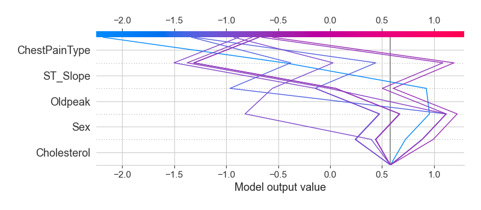
### Top-10 Best decisions for class 1 (Fold 1)
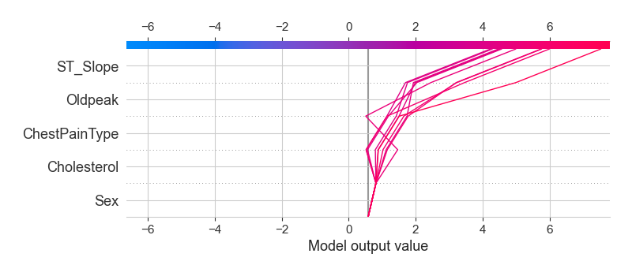

[<< Go back](../README.md)
