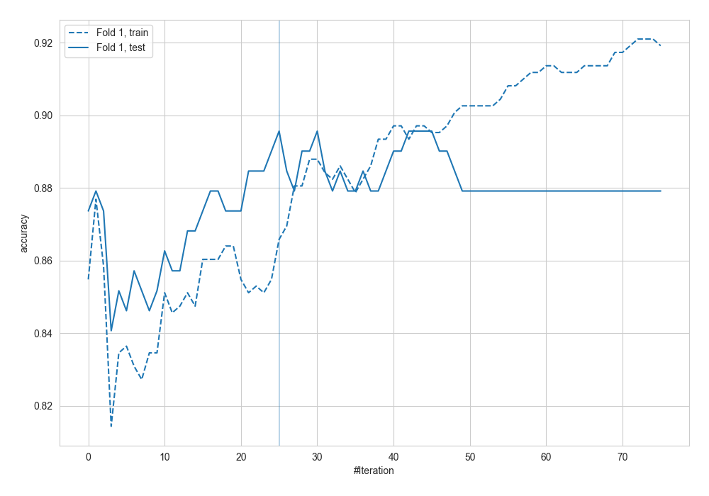
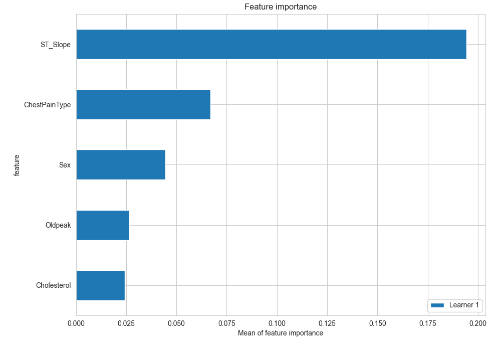
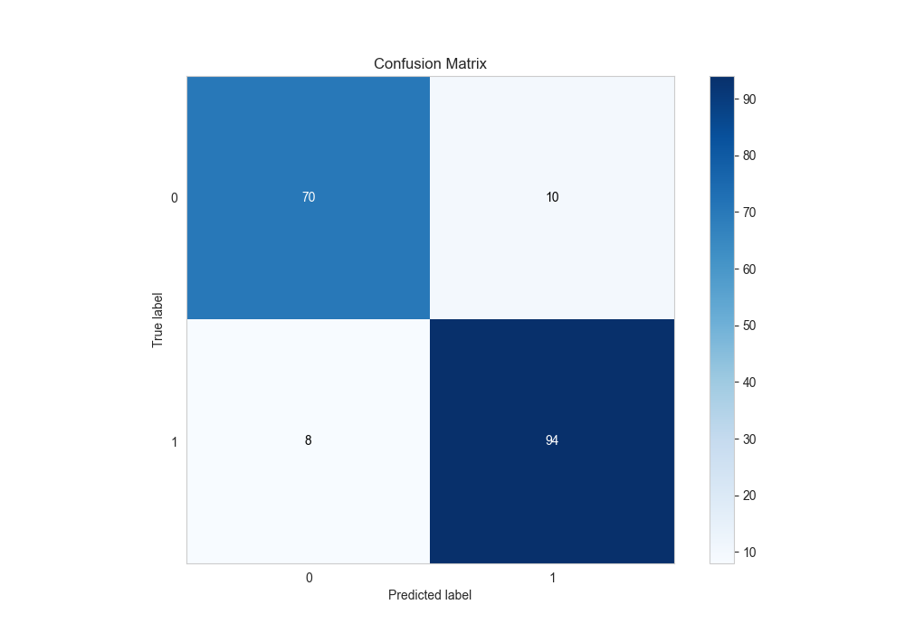
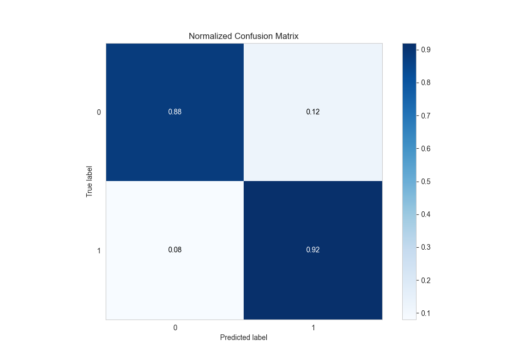
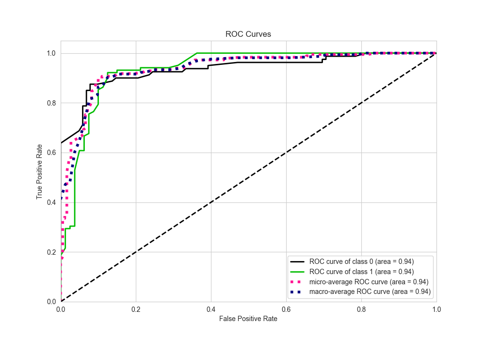
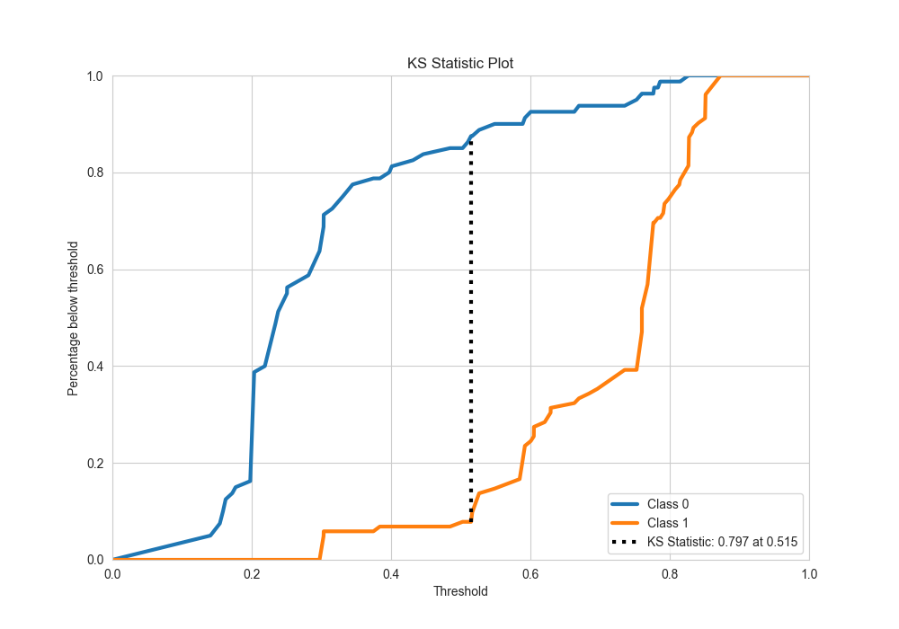
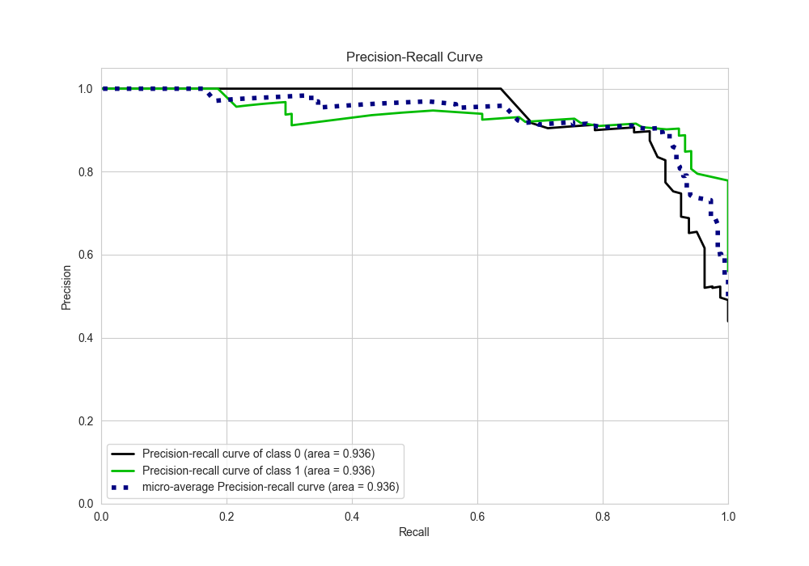
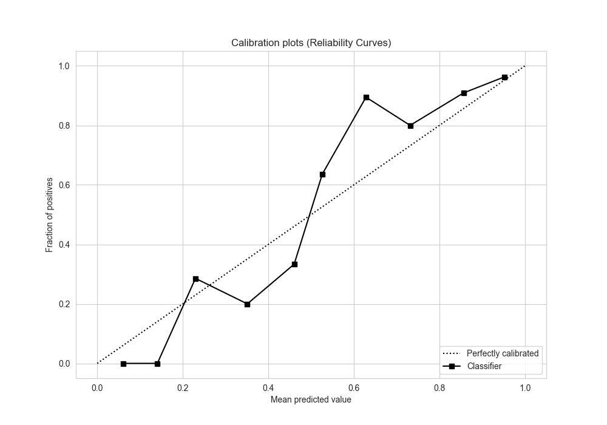
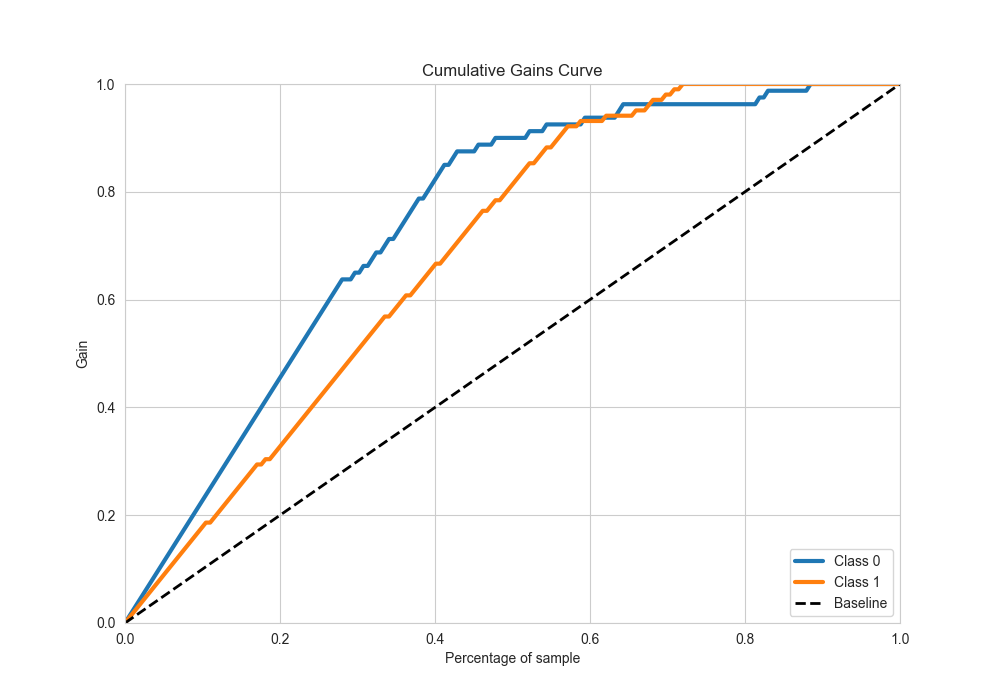
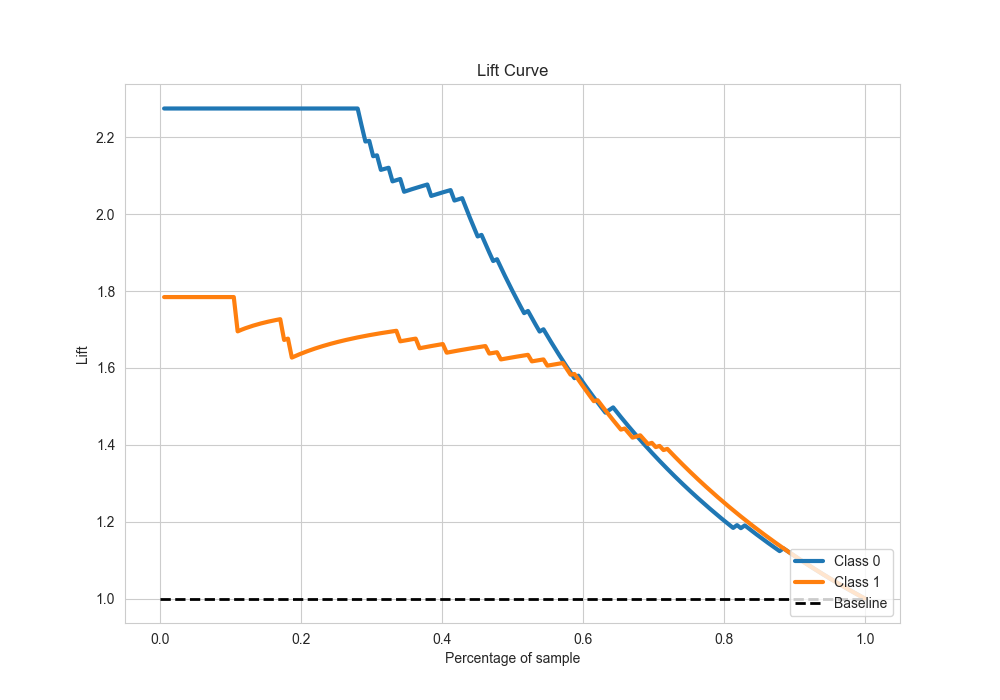

# Summary of 6_Default_CatBoost

[<< Go back](../README.md)

## CatBoost
- **n_jobs**: -1
- **learning_rate**: 0.1
- **depth**: 6
- **rsm**: 1
- **loss_function**: Logloss
- **eval_metric**: Accuracy
- **explain_level**: 2

## Validation
 - **validation_type**: split
 - **train_ratio**: 0.75
 - **shuffle**: True
 - **stratify**: True

## Optimized metric
accuracy

## Training time

2.0 seconds

## Metric details
|           |    score |   threshold |
|:----------|---------:|------------:|
| logloss   | 0.395095 |  nan        |
| auc       | 0.935846 |  nan        |
| f1        | 0.912621 |    0.515651 |
| accuracy  | 0.901099 |    0.515651 |
| precision | 0.927711 |    0.600456 |
| recall    | 1        |    0.126639 |
| mcc       | 0.798922 |    0.515651 |

## Metric details with threshold from accuracy metric
|           |    score |   threshold |
|:----------|---------:|------------:|
| logloss   | 0.395095 |  nan        |
| auc       | 0.935846 |  nan        |
| f1        | 0.912621 |    0.515651 |
| accuracy  | 0.901099 |    0.515651 |
| precision | 0.903846 |    0.515651 |
| recall    | 0.921569 |    0.515651 |
| mcc       | 0.798922 |    0.515651 |

## Confusion matrix (at threshold=0.515651)
|              |   Predicted as 0 |   Predicted as 1 |
|:-------------|-----------------:|-----------------:|
| Labeled as 0 |               70 |               10 |
| Labeled as 1 |                8 |               94 |

## Learning curves

## Permutation-based Importance

## Confusion Matrix

## Normalized Confusion Matrix

## ROC Curve

## Kolmogorov-Smirnov Statistic

## Precision-Recall Curve

## Calibration Curve

## Cumulative Gains Curve

## Lift Curve

[<< Go back](../README.md)
