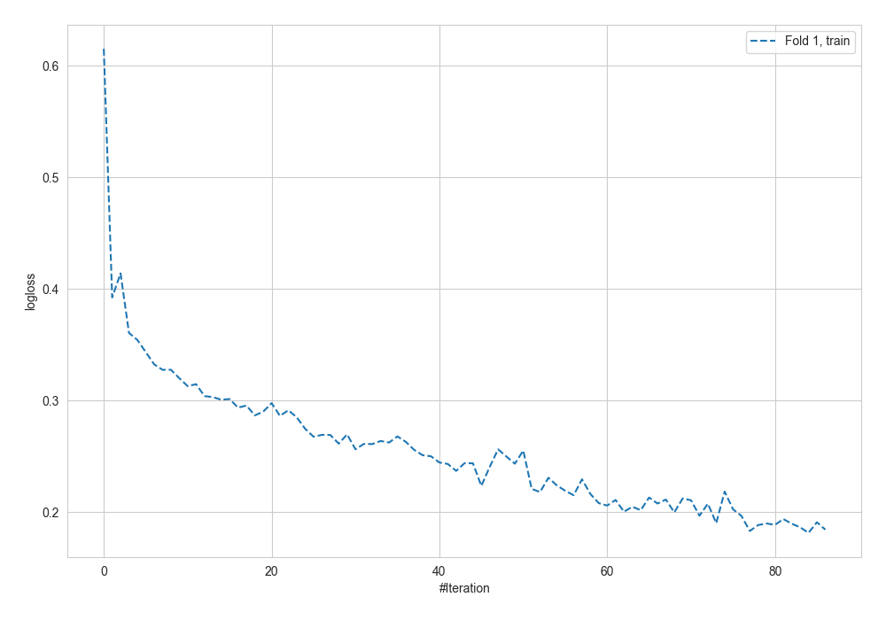
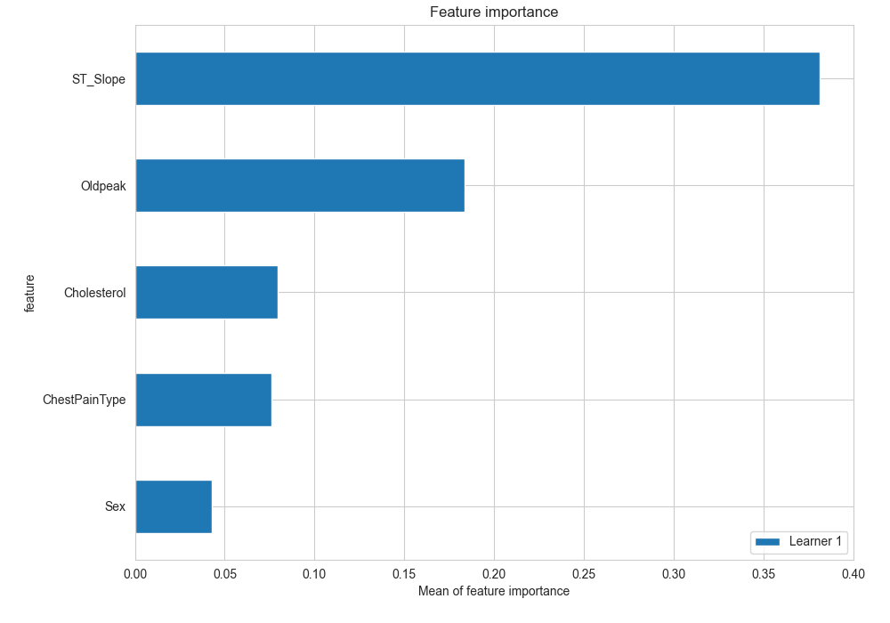
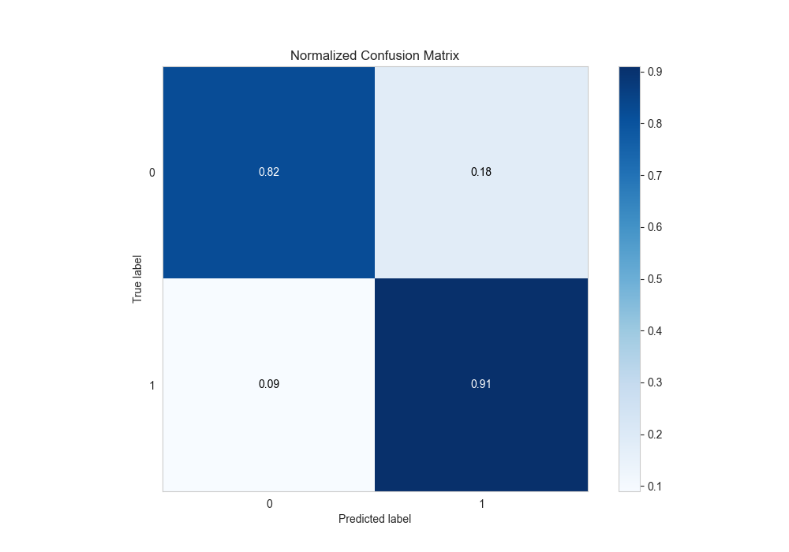
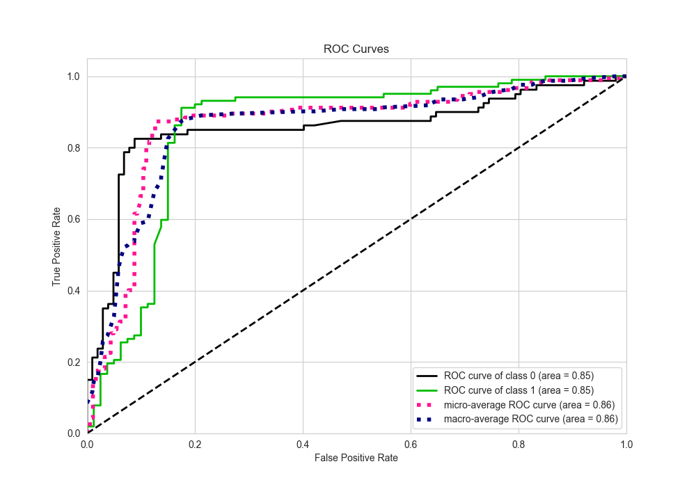
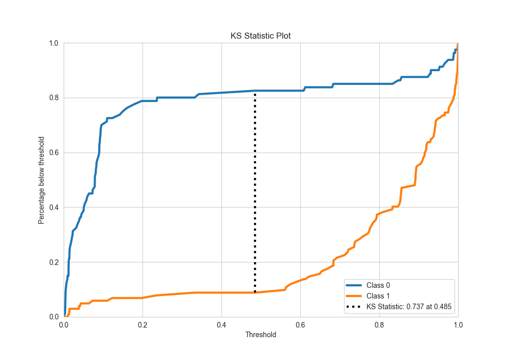
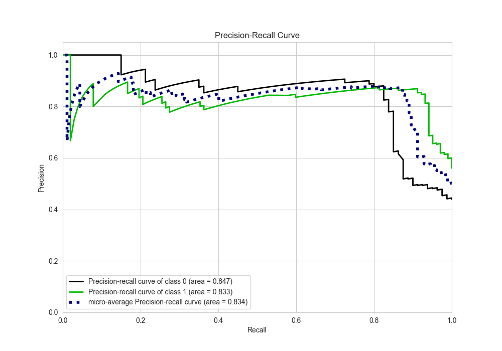
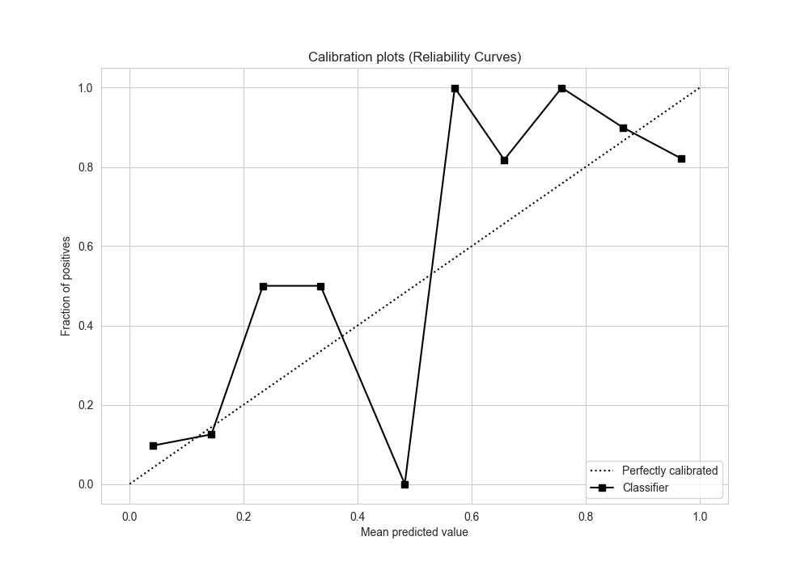
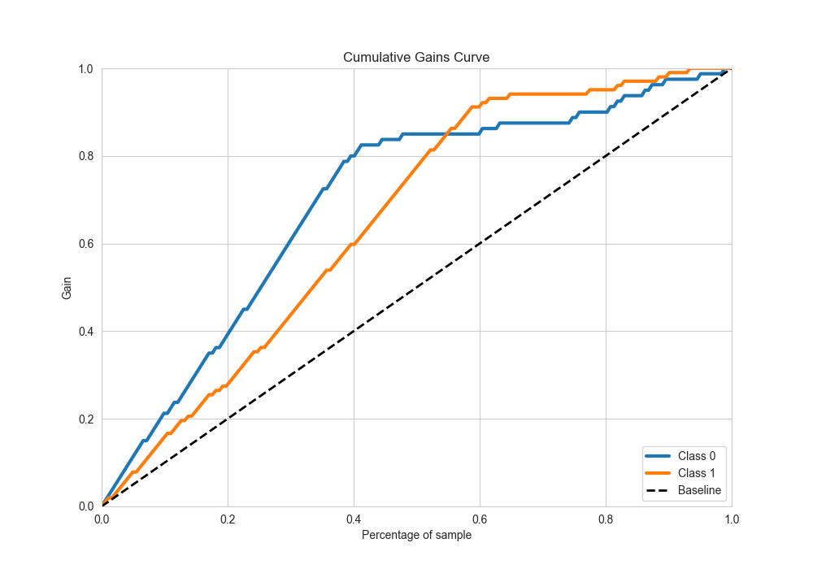
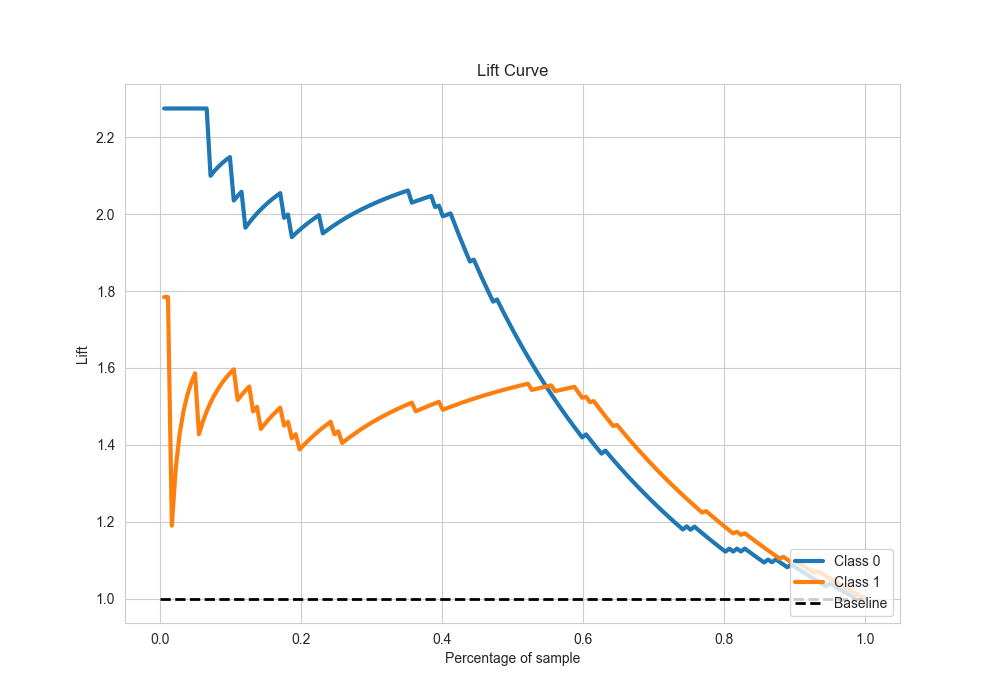

# Summary of 7_Default_NeuralNetwork

[<< Go back](../README.md)

## Neural Network
- **n_jobs**: -1
- **dense_1_size**: 32
- **dense_2_size**: 16
- **learning_rate**: 0.05
- **explain_level**: 2

## Validation
 - **validation_type**: split
 - **train_ratio**: 0.75
 - **shuffle**: True
 - **stratify**: True

## Optimized metric
accuracy

## Training time

3.0 seconds

## Metric details
|           |    score |    threshold |
|:----------|---------:|-------------:|
| logloss   | 0.532446 | nan          |
| auc       | 0.854718 | nan          |
| f1        | 0.889952 |   0.522761   |
| accuracy  | 0.873626 |   0.522761   |
| precision | 0.873684 |   0.683742   |
| recall    | 1        |   0.00318506 |
| mcc       | 0.742936 |   0.522761   |

## Metric details with threshold from accuracy metric
|           |    score |   threshold |
|:----------|---------:|------------:|
| logloss   | 0.532446 |  nan        |
| auc       | 0.854718 |  nan        |
| f1        | 0.889952 |    0.522761 |
| accuracy  | 0.873626 |    0.522761 |
| precision | 0.869159 |    0.522761 |
| recall    | 0.911765 |    0.522761 |
| mcc       | 0.742936 |    0.522761 |

## Confusion matrix (at threshold=0.522761)
|              |   Predicted as 0 |   Predicted as 1 |
|:-------------|-----------------:|-----------------:|
| Labeled as 0 |               66 |               14 |
| Labeled as 1 |                9 |               93 |

## Learning curves

## Permutation-based Importance

## Confusion Matrix

## Normalized Confusion Matrix

## ROC Curve

## Kolmogorov-Smirnov Statistic

## Precision-Recall Curve

## Calibration Curve

## Cumulative Gains Curve

## Lift Curve

[<< Go back](../README.md)
