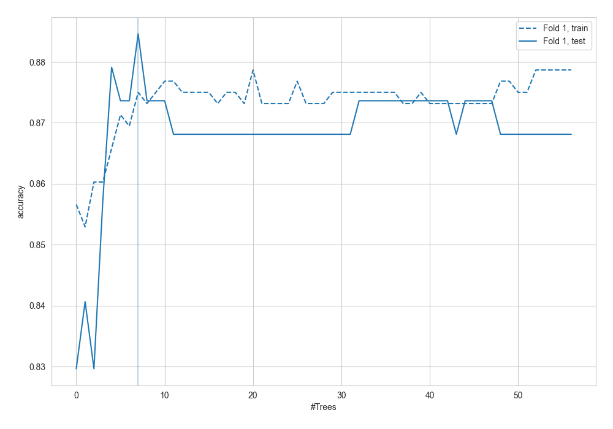
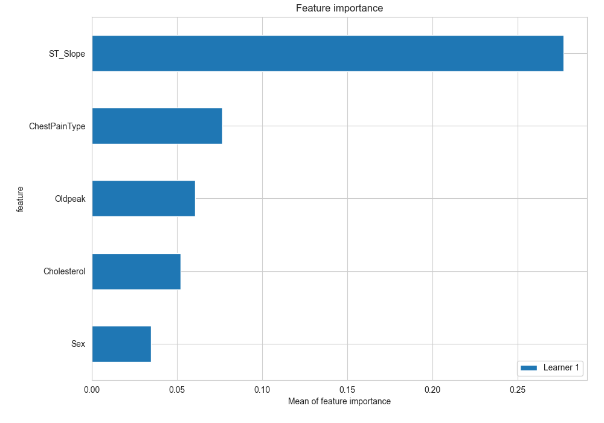
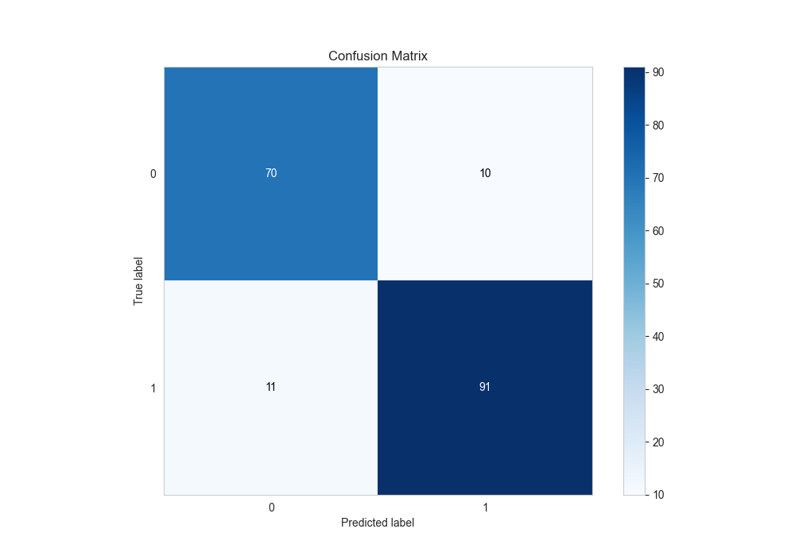
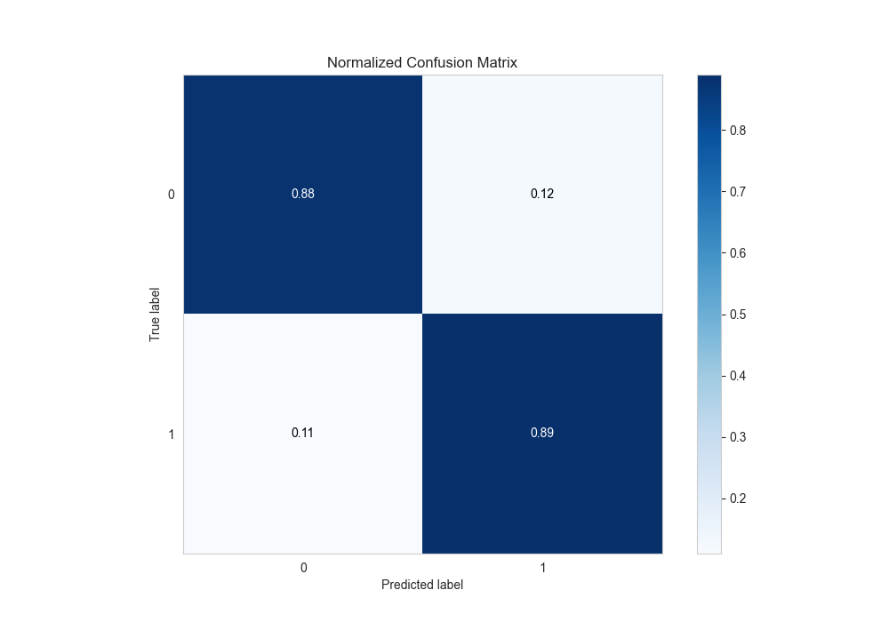
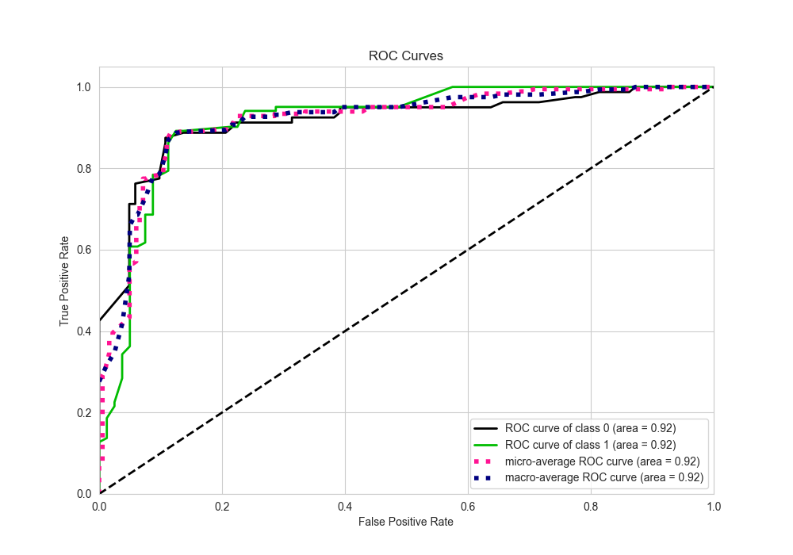
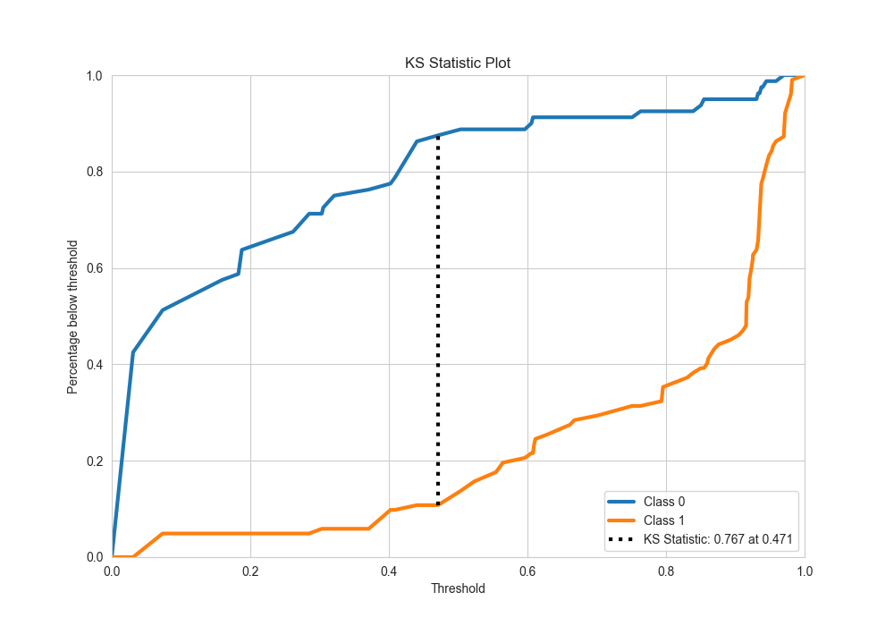
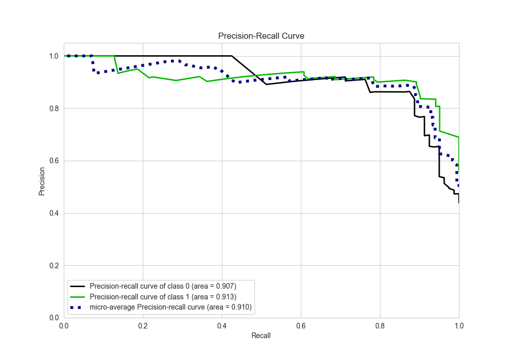
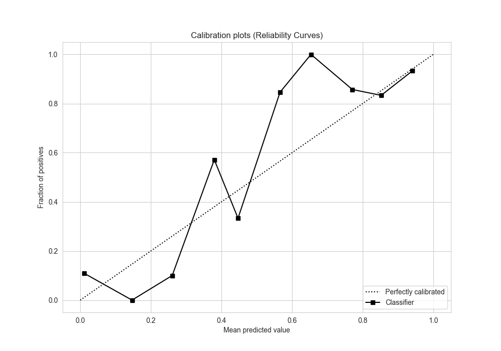
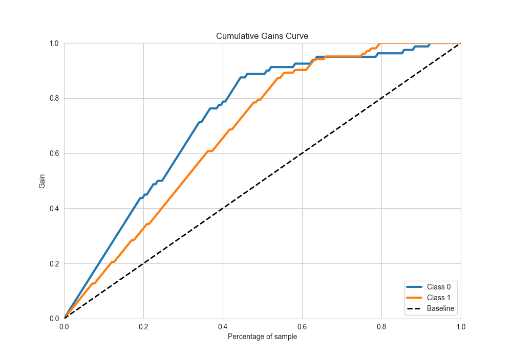
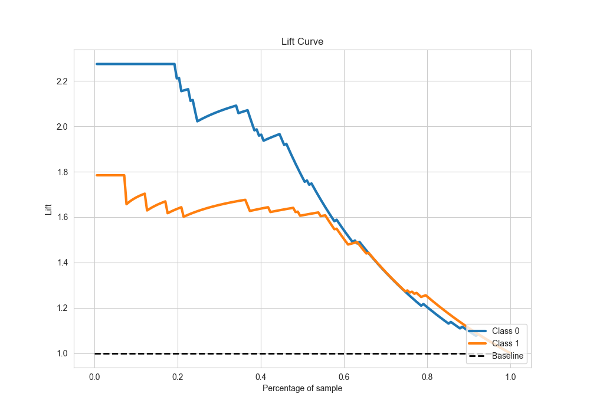

# Summary of 8_Default_RandomForest

[<< Go back](../README.md)

## Random Forest
- **n_jobs**: -1
- **criterion**: gini
- **max_features**: 0.9
- **min_samples_split**: 30
- **max_depth**: 4
- **eval_metric_name**: accuracy
- **explain_level**: 2

## Validation
 - **validation_type**: split
 - **train_ratio**: 0.75
 - **shuffle**: True
 - **stratify**: True

## Optimized metric
accuracy

## Training time

2.5 seconds

## Metric details
|           |    score |   threshold |
|:----------|---------:|------------:|
| logloss   | 0.368617 | nan         |
| auc       | 0.915074 | nan         |
| f1        | 0.896552 |   0.487133  |
| accuracy  | 0.884615 |   0.487133  |
| precision | 0.91954  |   0.608848  |
| recall    | 1        |   0.0277305 |
| mcc       | 0.766172 |   0.487133  |

## Metric details with threshold from accuracy metric
|           |    score |   threshold |
|:----------|---------:|------------:|
| logloss   | 0.368617 |  nan        |
| auc       | 0.915074 |  nan        |
| f1        | 0.896552 |    0.487133 |
| accuracy  | 0.884615 |    0.487133 |
| precision | 0.90099  |    0.487133 |
| recall    | 0.892157 |    0.487133 |
| mcc       | 0.766172 |    0.487133 |

## Confusion matrix (at threshold=0.487133)
|              |   Predicted as 0 |   Predicted as 1 |
|:-------------|-----------------:|-----------------:|
| Labeled as 0 |               70 |               10 |
| Labeled as 1 |               11 |               91 |

## Learning curves

## Permutation-based Importance

## Confusion Matrix

## Normalized Confusion Matrix

## ROC Curve

## Kolmogorov-Smirnov Statistic

## Precision-Recall Curve

## Calibration Curve

## Cumulative Gains Curve

## Lift Curve

[<< Go back](../README.md)
