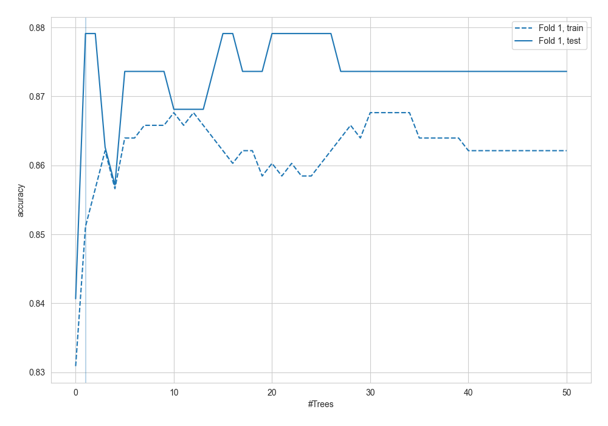
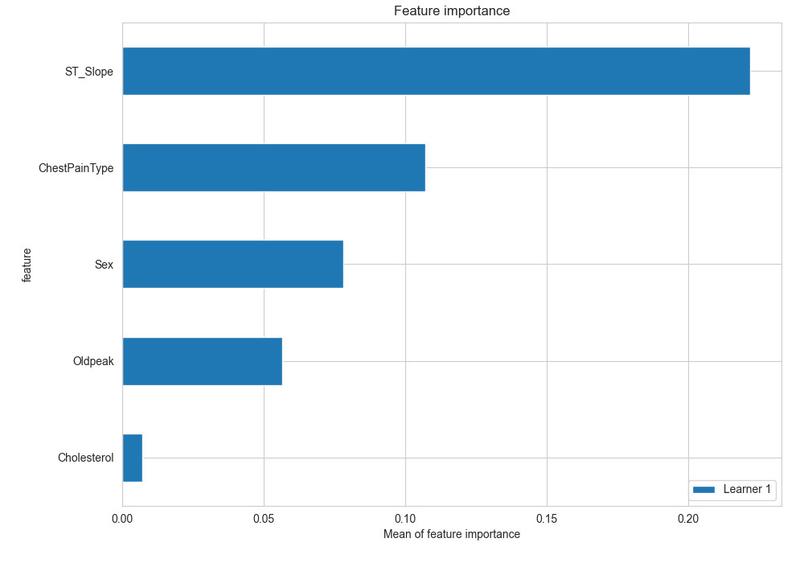
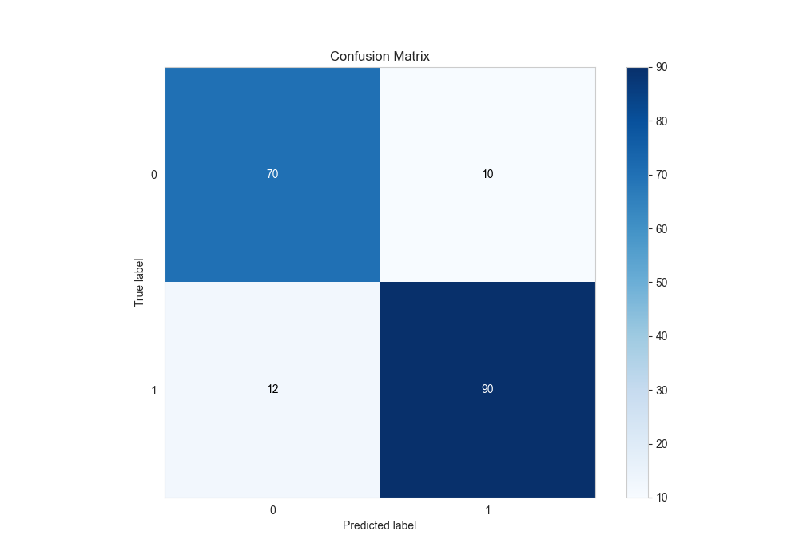
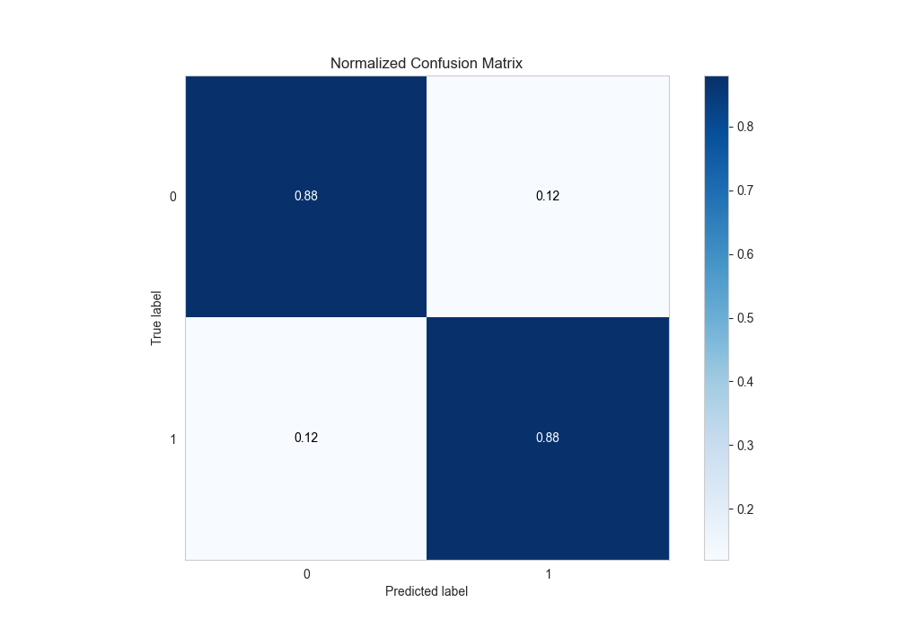
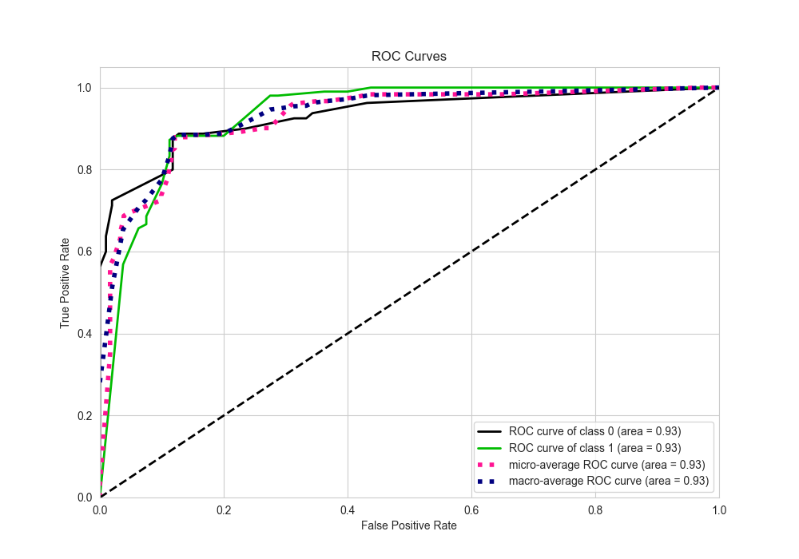
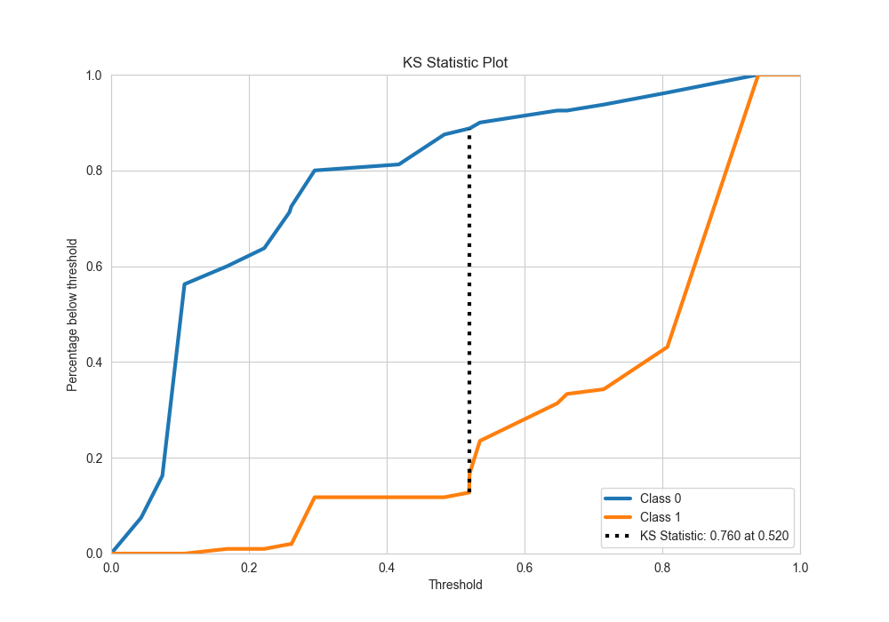
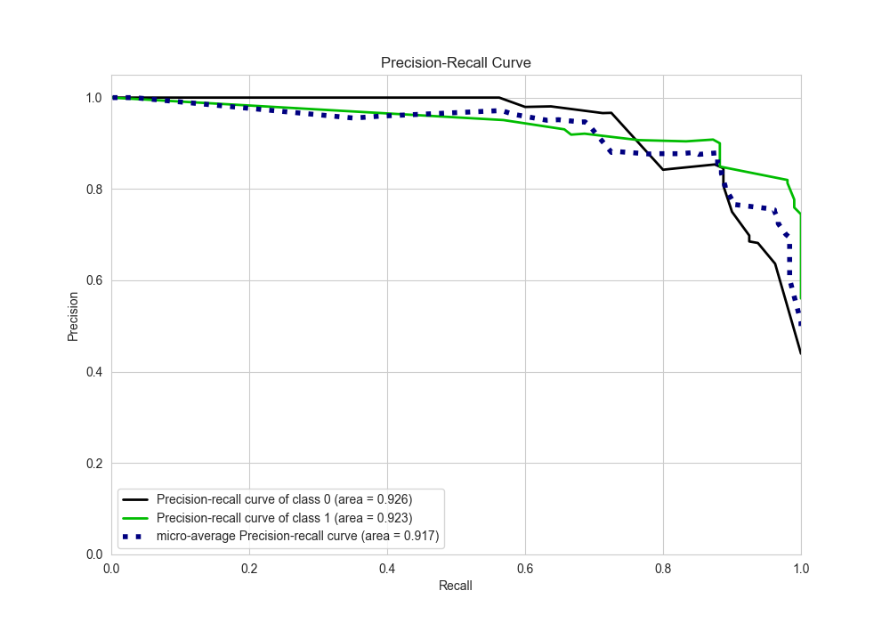
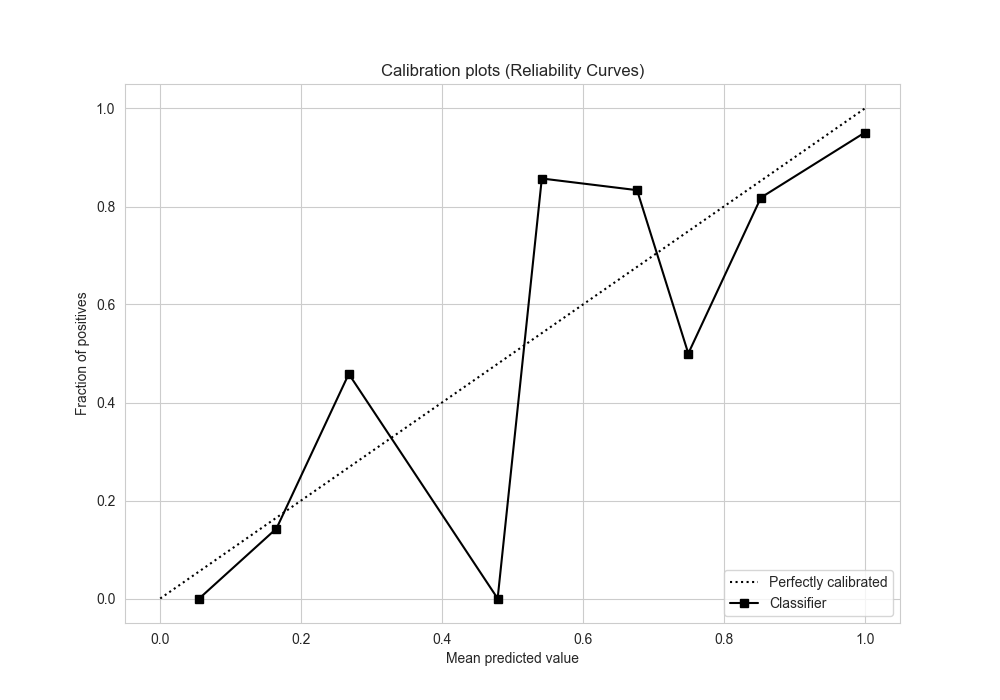
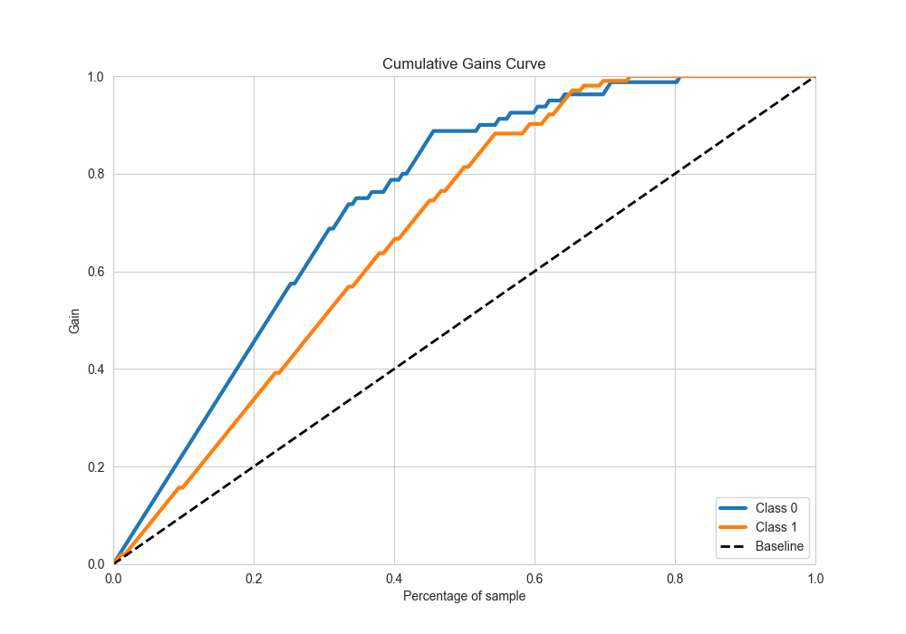
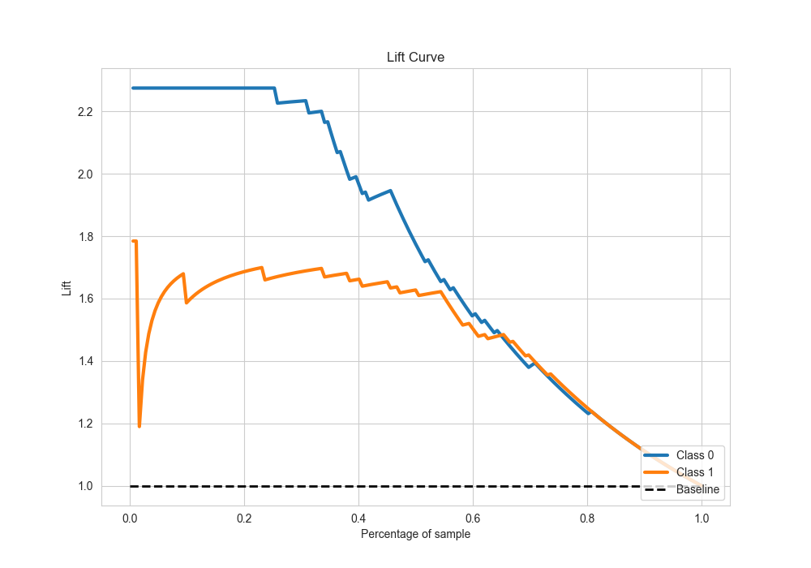

# Summary of 9_Default_ExtraTrees

[<< Go back](../README.md)

## Extra Trees Classifier (Extra Trees)
- **n_jobs**: -1
- **criterion**: gini
- **max_features**: 0.9
- **min_samples_split**: 30
- **max_depth**: 4
- **eval_metric_name**: accuracy
- **explain_level**: 2

## Validation
 - **validation_type**: split
 - **train_ratio**: 0.75
 - **shuffle**: True
 - **stratify**: True

## Optimized metric
accuracy

## Training time

2.2 seconds

## Metric details
|           |    score |   threshold |
|:----------|---------:|------------:|
| logloss   | 0.348739 | nan         |
| auc       | 0.932475 | nan         |
| f1        | 0.892857 |   0.278508  |
| accuracy  | 0.879121 |   0.483571  |
| precision | 0.921053 |   0.6475    |
| recall    | 1        |   0.0392015 |
| mcc       | 0.756718 |   0.519608  |

## Metric details with threshold from accuracy metric
|           |    score |   threshold |
|:----------|---------:|------------:|
| logloss   | 0.348739 |  nan        |
| auc       | 0.932475 |  nan        |
| f1        | 0.891089 |    0.483571 |
| accuracy  | 0.879121 |    0.483571 |
| precision | 0.9      |    0.483571 |
| recall    | 0.882353 |    0.483571 |
| mcc       | 0.755503 |    0.483571 |

## Confusion matrix (at threshold=0.483571)
|              |   Predicted as 0 |   Predicted as 1 |
|:-------------|-----------------:|-----------------:|
| Labeled as 0 |               70 |               10 |
| Labeled as 1 |               12 |               90 |

## Learning curves

## Permutation-based Importance

## Confusion Matrix

## Normalized Confusion Matrix

## ROC Curve

## Kolmogorov-Smirnov Statistic

## Precision-Recall Curve

## Calibration Curve

## Cumulative Gains Curve

## Lift Curve

[<< Go back](../README.md)
