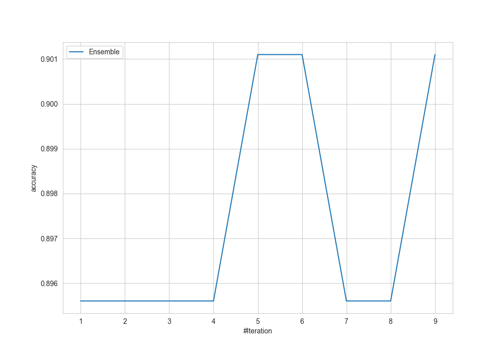
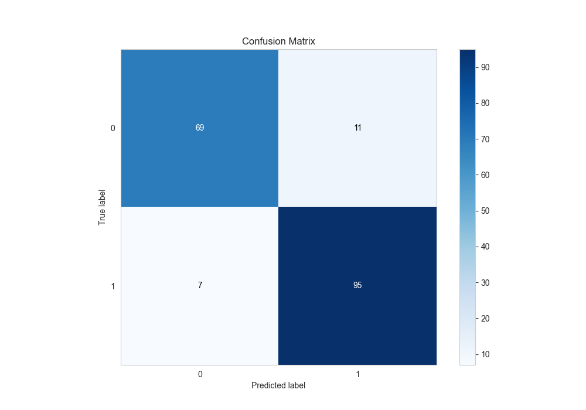
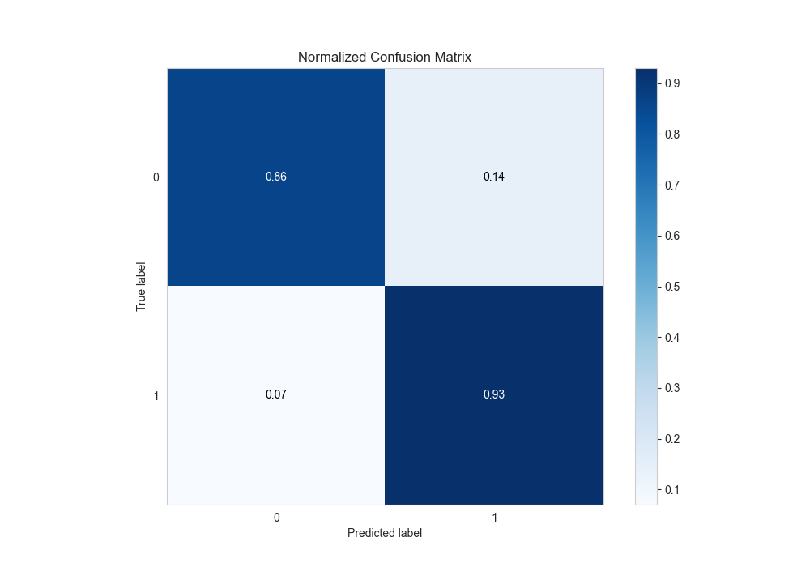
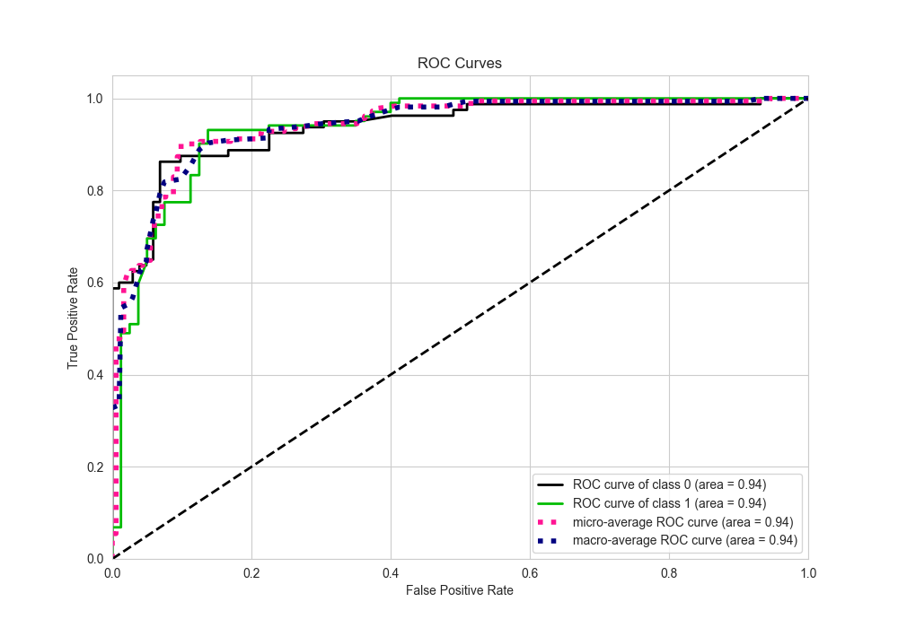
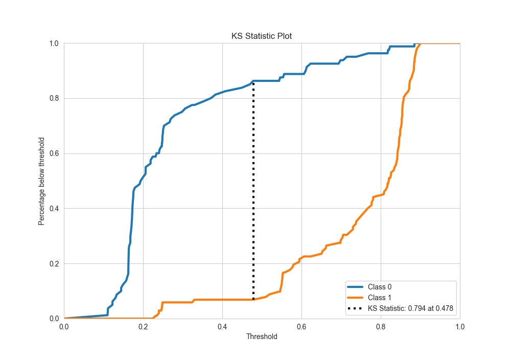
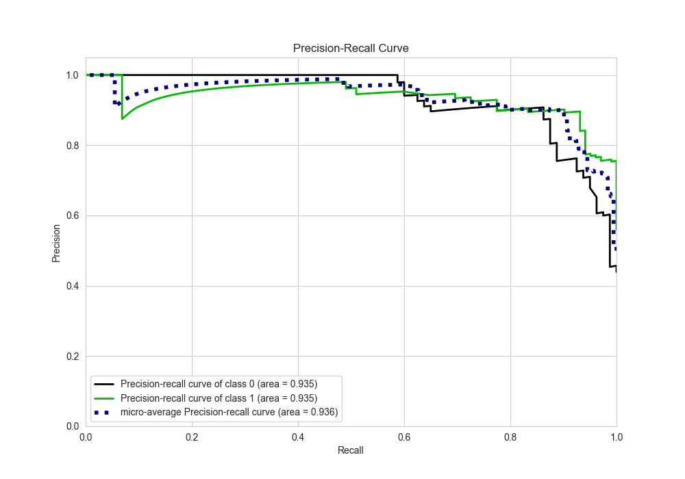
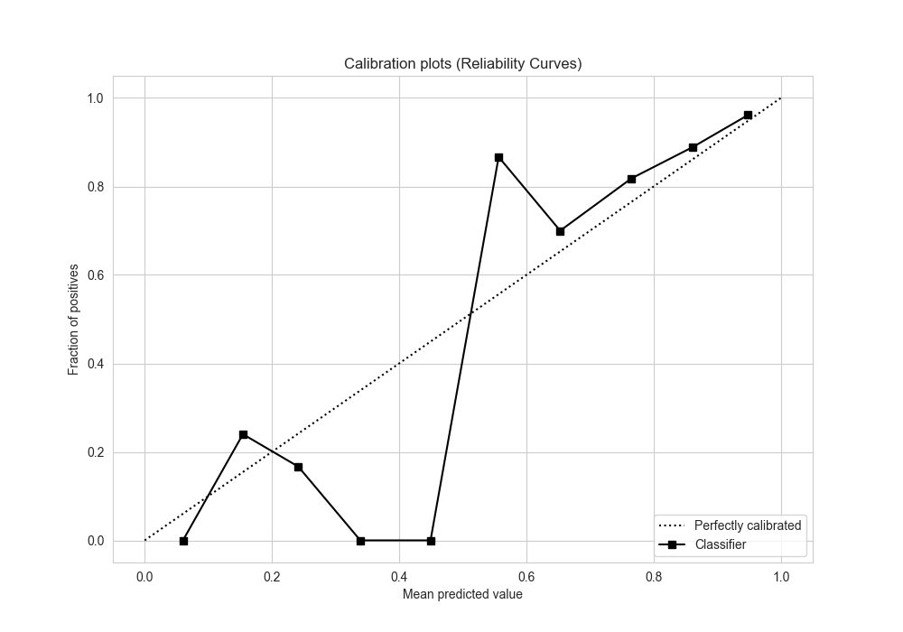
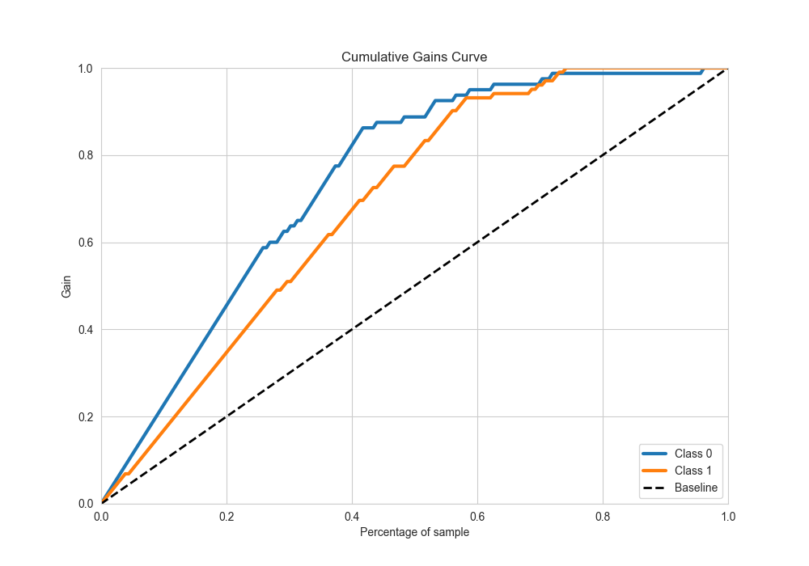
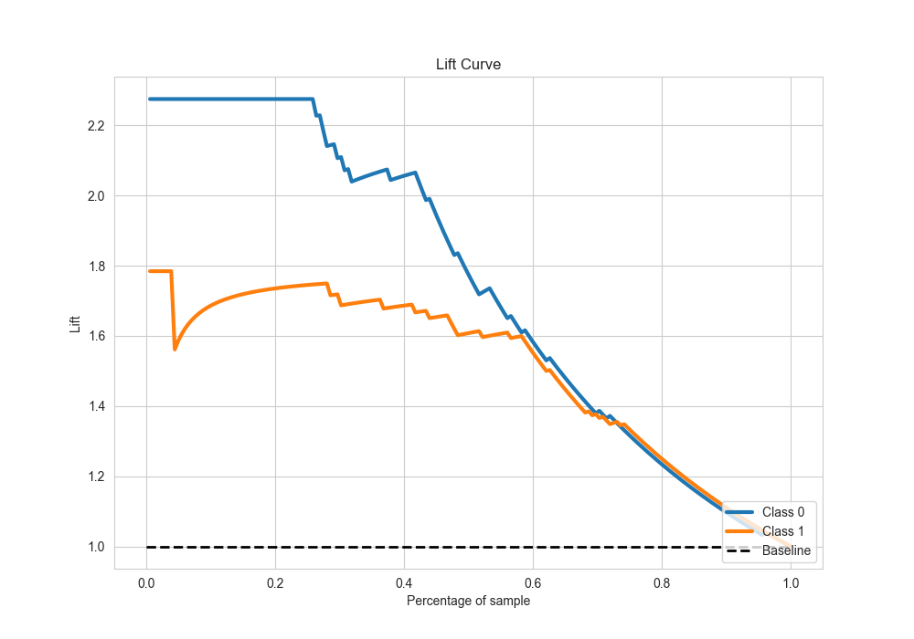

# Summary of Ensemble

[<< Go back](../README.md)

## Ensemble structure
| Model              |   Weight |
|:-------------------|---------:|
| 3_Linear           |        1 |
| 5_Default_Xgboost  |        2 |
| 6_Default_CatBoost |        2 |

## Metric details
|           |    score |   threshold |
|:----------|---------:|------------:|
| logloss   | 0.361853 | nan         |
| auc       | 0.936826 | nan         |
| f1        | 0.913462 |   0.493854  |
| accuracy  | 0.901099 |   0.493854  |
| precision | 0.929412 |   0.636708  |
| recall    | 1        |   0.0991634 |
| mcc       | 0.79898  |   0.493854  |

## Metric details with threshold from accuracy metric
|           |    score |   threshold |
|:----------|---------:|------------:|
| logloss   | 0.361853 |  nan        |
| auc       | 0.936826 |  nan        |
| f1        | 0.913462 |    0.493854 |
| accuracy  | 0.901099 |    0.493854 |
| precision | 0.896226 |    0.493854 |
| recall    | 0.931373 |    0.493854 |
| mcc       | 0.79898  |    0.493854 |

## Confusion matrix (at threshold=0.493854)
|              |   Predicted as 0 |   Predicted as 1 |
|:-------------|-----------------:|-----------------:|
| Labeled as 0 |               69 |               11 |
| Labeled as 1 |                7 |               95 |

## Learning curves

## Confusion Matrix

## Normalized Confusion Matrix

## ROC Curve

## Kolmogorov-Smirnov Statistic

## Precision-Recall Curve

## Calibration Curve

## Cumulative Gains Curve

## Lift Curve

[<< Go back](../README.md)
