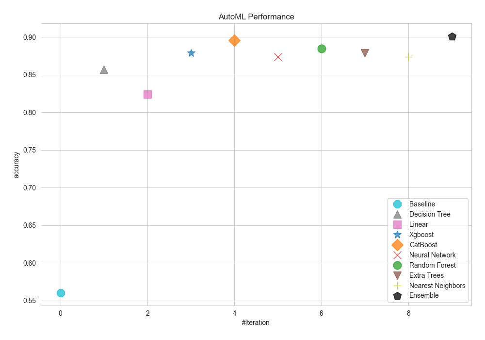
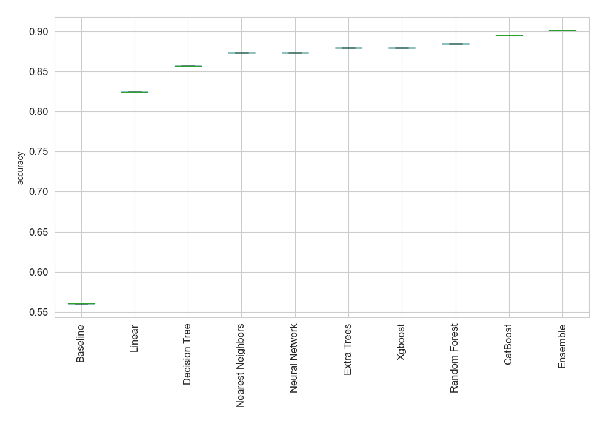
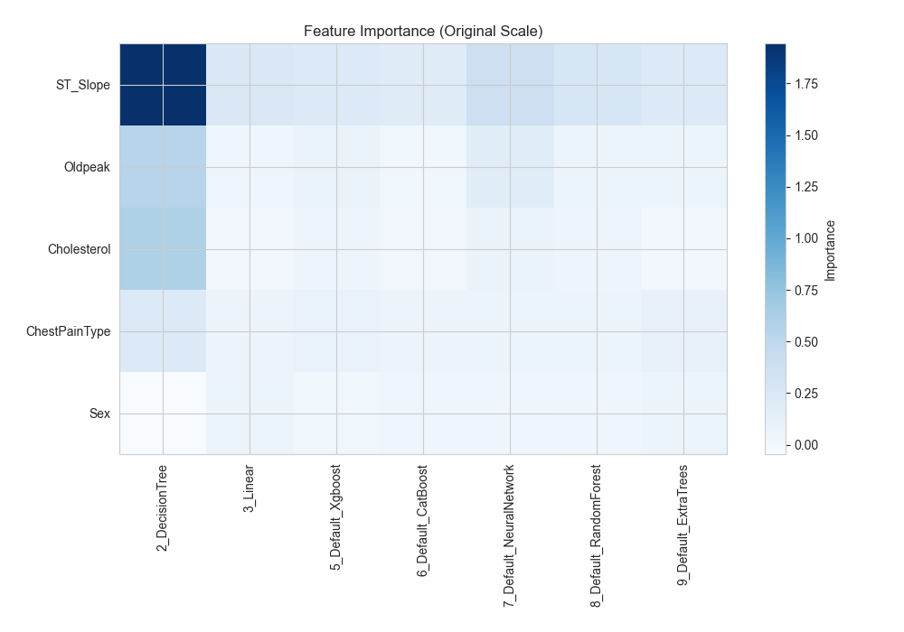
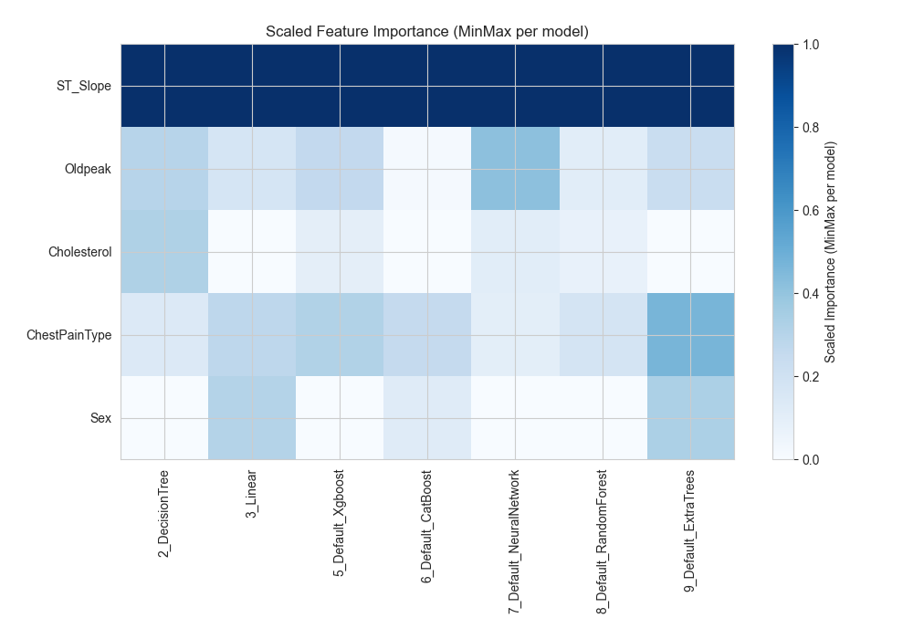
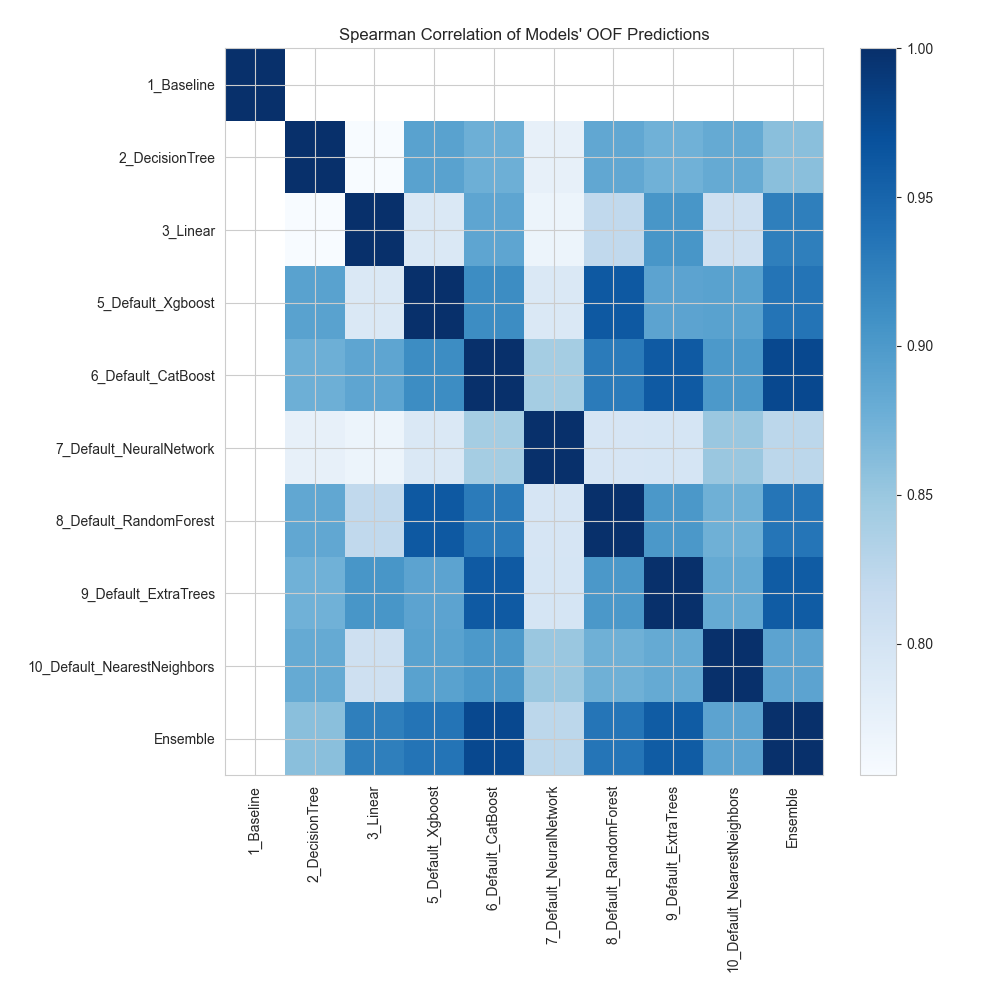

# AutoML Leaderboard

> Models in this report were generated and selected automatically by MLJAR AutoML. Review model behavior, data suitability, and decision impact before important use.

| Best model   | name                                                                 | model_type        | metric_type   |   metric_value |   train_time |
|:-------------|:---------------------------------------------------------------------|:------------------|:--------------|---------------:|-------------:|
|              | [1_Baseline](1_Baseline/README.md)                                   | Baseline          | accuracy      |       0.56044  |         0.76 |
|              | [2_DecisionTree](2_DecisionTree/README.md)                           | Decision Tree     | accuracy      |       0.857143 |         8.23 |
|              | [3_Linear](3_Linear/README.md)                                       | Linear            | accuracy      |       0.824176 |         8.61 |
|              | [5_Default_Xgboost](5_Default_Xgboost/README.md)                     | Xgboost           | accuracy      |       0.879121 |         9.5  |
|              | [6_Default_CatBoost](6_Default_CatBoost/README.md)                   | CatBoost          | accuracy      |       0.895604 |         2.65 |
|              | [7_Default_NeuralNetwork](7_Default_NeuralNetwork/README.md)         | Neural Network    | accuracy      |       0.873626 |         3.86 |
|              | [8_Default_RandomForest](8_Default_RandomForest/README.md)           | Random Forest     | accuracy      |       0.884615 |         3.21 |
|              | [9_Default_ExtraTrees](9_Default_ExtraTrees/README.md)               | Extra Trees       | accuracy      |       0.879121 |         2.85 |
|              | [10_Default_NearestNeighbors](10_Default_NearestNeighbors/README.md) | Nearest Neighbors | accuracy      |       0.873626 |         2.2  |
| **the best** | [Ensemble](Ensemble/README.md)                                       | Ensemble          | accuracy      |       0.901099 |         1.71 |

### AutoML Performance

### AutoML Performance Boxplot

### Features Importance (Original Scale)

### Scaled Features Importance (MinMax per Model)

### Spearman Correlation of Models

